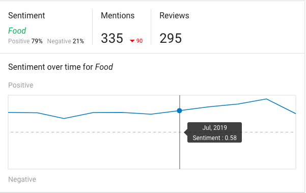

## What are analytics in Reputation Management?

Analytics in Reputation Management helps you gain deeper insight into how your business is perceived online. By analyzing review content and sentiment, you can identify key themes, track trends, and benchmark your performance against competitors.

## Why are analytics important?

Using analytics, you can:

- Understand what customers value most
- Detect recurring negative feedback
- Monitor changes in sentiment over time
- Compare your reputation to competitors
- Make informed decisions to improve your service or offerings

## What’s included in Reputation Management analytics?

### Trending Keywords

The `Trending Keywords` report highlights how commonly used keywords in reviews evolve over time. Positive mentions appear in green, and negative mentions appear in red.

### Keywords wordcloud

The `Keywords Wordcloud` shows a visual representation of the most frequently mentioned terms in your reviews. Larger words represent higher frequency.

### Machine learning-based insights

This section uses natural language processing to identify common themes and the overall sentiment of your reviews.

### Keyword details

`Keyword Details` provides metrics on how often specific terms are used, along with the sentiment associated with each keyword.

### Descriptive words

This section highlights adjectives and other descriptive terms commonly used by your customers, offering insight into how they describe your business.

## How to use analytics in Reputation Management

1. Go to the `Reputation Management` dashboard.
2. Navigate to the `Analytics` tab.
3. Review each section to identify patterns and customer sentiment.
4. Use the insights to adjust your service approach or marketing focus.

## Frequently asked questions 

How are keywords generated in the Analytics section?

Keywords are identified automatically using Google's machine learning algorithm. The system analyzes entire reviews to determine key topics and sentiment without manual keyword input.

Are the keyword insights always accurate?

The machine learning model improves over time but may occasionally misinterpret phrasing or context. Some inaccuracies are possible.

What does the color-coding in Trending Keywords represent?

Green indicates a positive sentiment tied to a keyword, while red indicates a negative sentiment.

Why do some words appear larger in the Wordcloud?

Larger words are mentioned more frequently in customer reviews.

Can I filter analytics by date or location?

Filtering options depend on the configuration of your Reputation Management dashboard. Check for filters at the top of the analytics page.

How often is the analytics data updated?

Review analytics update automatically as new reviews are collected and processed.

What should I do with negative trending keywords?

Use them to identify common concerns and take corrective action to improve customer experience.

Can I download or export the analytics reports?

Availability of export features may vary. Look for a download or export button within the Analytics tab.

