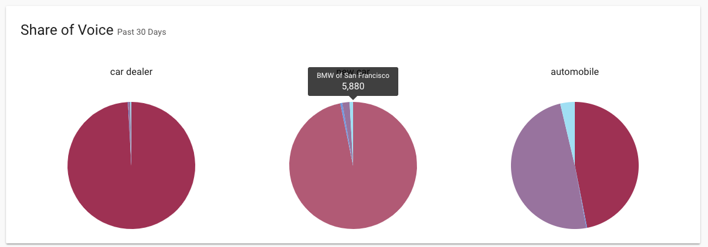
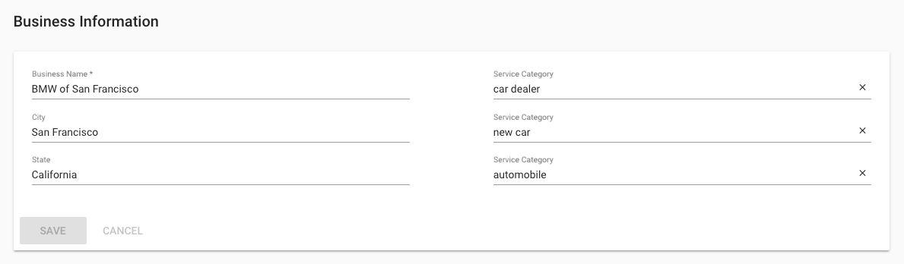
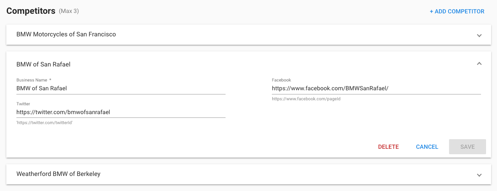

## What is Share of Voice?

Share of Voice shows you how often your business is mentioned in web content and turning up in local searches, compared to competitors.

Keeping track of how much of this conversation, and the attention of consumers, your brand owns versus your competitors helps you to gauge:

- brand awareness
- brand equity
- target audience engagement.

Over time this allows you to report who has gained or lost ground among target consumers for your industry.

*The Share of Voice graph shows you how often your business is mentioned in web content and turning up in local searches, compared to your competitors.*

## Best Practices when using Share of Voice

**Share of Voice** can be used as a powerful competitor analysis tool when configured correctly. It can measure how often a business is associated with a particular service - e.g. "Car Dealer" or "New Car", then compare that volume to your competitors. Share of Voice is calculated based on these Service Categories that you choose.

In the **Competition** section of the **Analytics** tab, you are able to edit the Service Categories and choose which Competitors to monitor.

**Getting started in 3 easy steps:**

In **Reputation Management** go to **Analytics > Competition**.

**Step 1:**

Ensure that the **Business Name** field is populated with the most common name to which the business is referred. If the business is usually referred to with a shortened name, update the Business Name field with that version. The results will more accurately represent how often the business appears when specific **Service Categories** are searched.

*Please be aware that changing the business name in **Settings > Competition** does not affect how the business appears in other portions of the platform.*

**Step 2:**

Choose your **Service Categories**. These can range from services and products offered by the business to specific keywords that are related to the customer's experience. The categories can be very specific (i.e. car dealer) to broad (i.e. new car). Each service category will create a separate pie chart in the Competition tab.

**Step 3:**

Enter your top **Competitors**. We recommend choosing businesses that sell similar products or services. Similar to the Business Name provided above, enter the most common name used by the competitors' business and ensure you enter the accurate social profile URLs. Up to three competitors can be added.

## How often does my Share Of Voice get calculated?

Share of Voice will search immediately if the search criteria are changed, and is calculated at least once monthly.

## Why is the chart showing 0% Share Of Voice?

**Tips for better results**

1. The search terms you have entered may be too general. If you own a pizzeria in New York, you might have a 0% Share Of Voice for "Restaurant + New York" but a significantly higher share for "Pizza + New York."
2. Check if the company name you have entered is too specific. If you enter your business name as "Andrea's New York Style Pizzeria", Share of Voice will search for results where those exact words appear. You might have more luck searching for "Andrea's Pizzeria" or just "Andrea's."

Try experimenting with the above options until you find a combination that returns useful results.