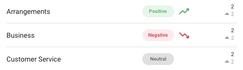
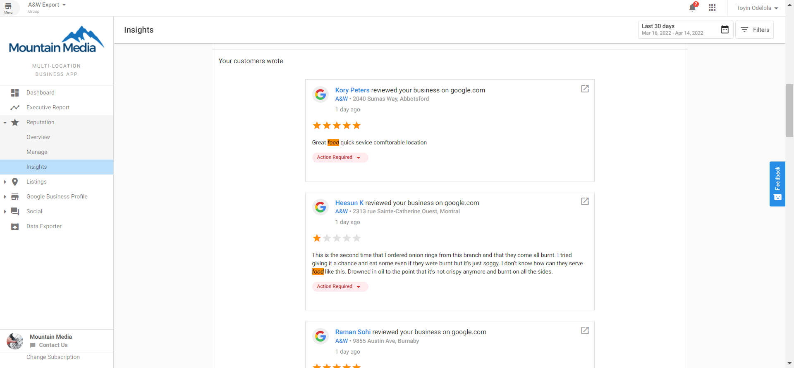

# Analytics in Reputation Management - Getting Started

<iframe width="560" height="315" src="https://www.youtube.com/embed/8iEWNisIsAo?si=A5nMhDJ-BUMCoZnf" title="YouTube video player" frameborder="0" allow="accelerometer; autoplay; clipboard-write; encrypted-media; gyroscope; picture-in-picture; web-share" referrerpolicy="strict-origin-when-cross-origin" allowfullscreen></iframe>

Within the Reputation Management App, you can access Analytics for additional insight into the reputation of your business. This provides you with an understanding of what makes up your review ratings, what people are saying about your business, and how that compares to your competitors.

## Trending Keywords

In the Trending Keywords report, you can analyze how your most prevalent reviews and trending keywords have evolved over time. A positive review featuring a trending keyword is displayed in green, while a negative review with a trending keyword appears in red.

## Keywords Wordcloud

The Keywords Wordcloud offers a visual representation of the most frequent words and phrases mentioned in your reviews. Words that appear more often are displayed in larger font sizes.

## Machine Learning-Based Insights

The machine learning-based insights use natural language processing to analyze your reviews and identify common themes and sentiments.

## Keyword Details

This section provides deeper analysis into individual keywords, showing you the frequency and sentiment of specific terms used in reviews about your business.

## Descriptive Words

The Descriptive Words section highlights the adjectives and descriptive terms most commonly used in reviews about your business, giving you insight into how customers perceive your services or products.

## Benefits of Analytics

- Understand what customers appreciate about your business
- Identify areas for improvement based on negative keywords
- Track changes in sentiment over time
- Compare your performance against competitors
- Make data-driven decisions to improve your reputation