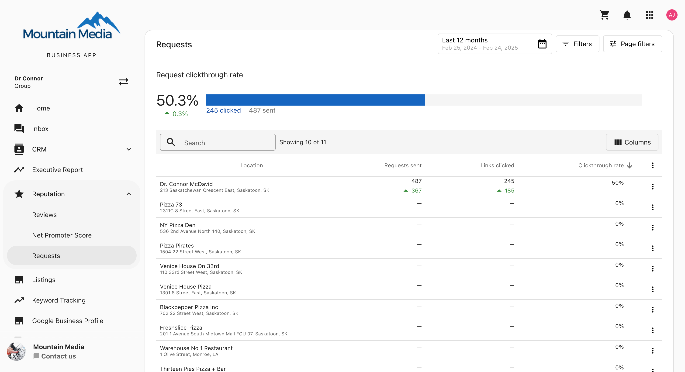
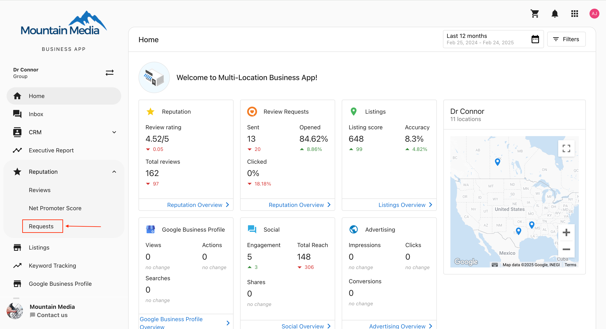
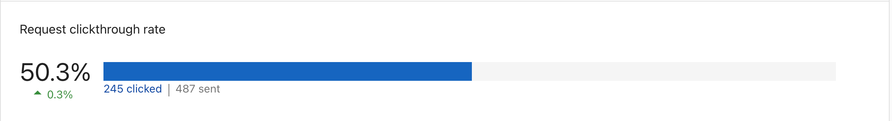
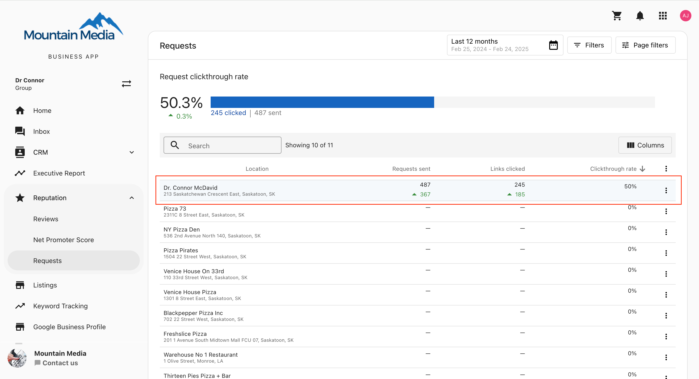
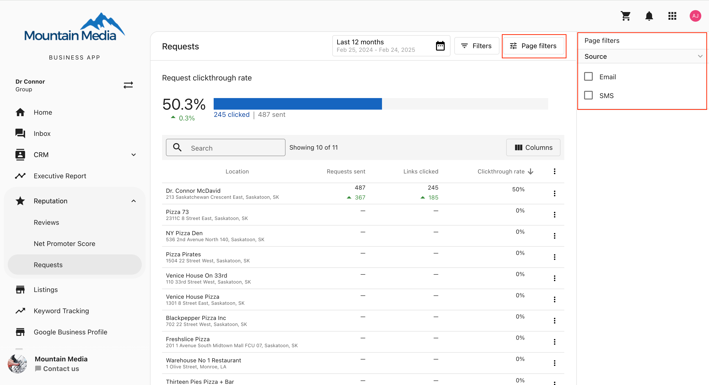

# Tracking Request Performance Metrics for Multi-Location Businesses

Tracking review request performance metrics is crucial for understanding and improving the request process within the multi-location section of Business App.

## Accessing Request Performance Metrics

To access Request Performance metrics for multi-location businesses:

1. From your main Account List, navigate to the "Requests" menu item located in the Navigation Bar

2. Select "Performance" from the submenu

## Understanding the Metrics

The Performance page displays an overview of request performance metrics for all locations within the business:

### Key Metrics Explained

- **Requests Sent**: The total number of review requests sent
- **Email Open Rate**: The percentage of sent emails that were opened
- **Feedback Rate**: The percentage of requests that resulted in feedback (either from the review site or from your feedback form)
- **Reviews Collected**: The number of reviews collected as a result of your requests

## Viewing Metrics by Location

Below the overview, you can see metrics broken down by individual locations:

This view allows you to compare performance across different locations and identify which locations may need additional attention or support.

## Filtering Options

The filter options in the top right corner allow you to customize the date range and filter by specific locations:

You can:
- Set a specific date range for the data
- Filter by location name
- Sort the data by various metrics

## Using These Metrics

These metrics can help you:

- Identify which locations are most effective at generating reviews
- Spot trends in review request performance over time
- Compare the performance of different locations to identify best practices
- Identify locations that may need additional training or support with their review request process

## Best Practices

1. **Regular Monitoring**: Check these metrics regularly to track progress and identify issues early
2. **Compare Locations**: Use the location breakdown to identify top performers and share their strategies with other locations
3. **Test Different Approaches**: Try different request methods or messaging and track the impact on your metrics
4. **Set Goals**: Establish performance targets for each location based on these metrics