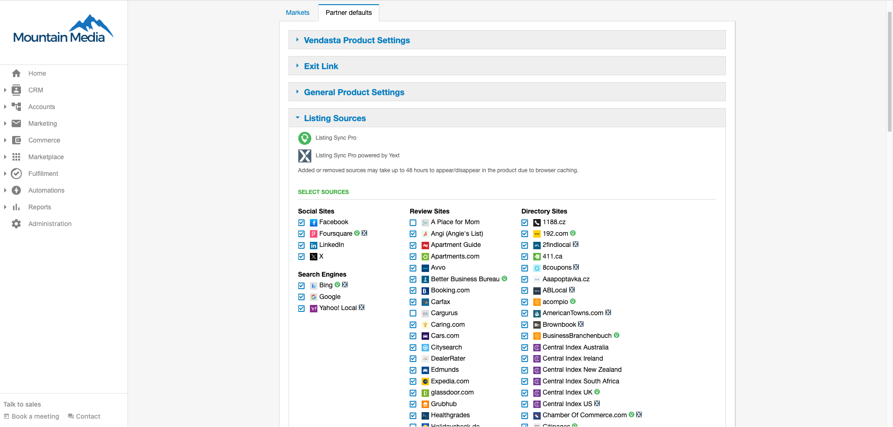

To add/remove listing sources from the available list go to **Partner Center > Administration > Customize > Listing Sources.** The sources will indicate whether they are monitored as a part of your Listing Sync Pro Yext or Uberall subscription with the logo of each displayed next to it.

- Check the box next to the listing source to add
- Uncheck to remove

