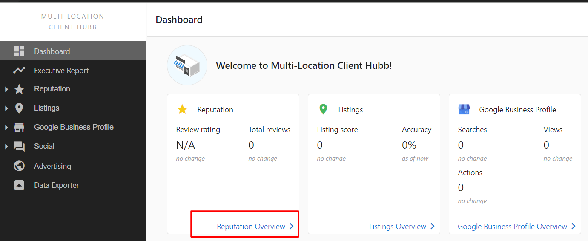
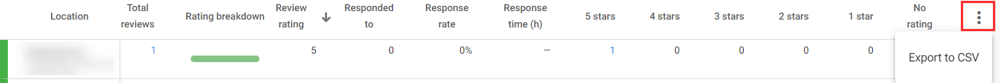

# How can I get an Export of My Reviews?

There are a few ways to get an export of your reviews. The first method allows you to export reviews from the reputation overview. The second method allows you to export reviews from the reviews section of each individual listing.

## Reputation Overview Export

To export reviews from the Reputation Overview screen:

1. In the Business App, click on **Reputation** > **Reviews**
2. Click on the **More Options** icon (three dots) in the top right corner
   
3. Then, select **Export to CSV**

Your export will include all reviews from all listings.

## Individual Listing Export

To export reviews from an individual listing:

1. In the Business App, click on **Reputation** > **Listings**
2. Click on the listing you want to export reviews from
3. Click on the **Reviews** tab
4. Click on the **More Options** icon (three dots) in the top right corner
5. Select **Export to CSV**

Your export will be limited to just the reviews from that listing.

**Note**: The export includes the date, listing source (like Google, Facebook, etc.), the review content, and the star rating for each review.