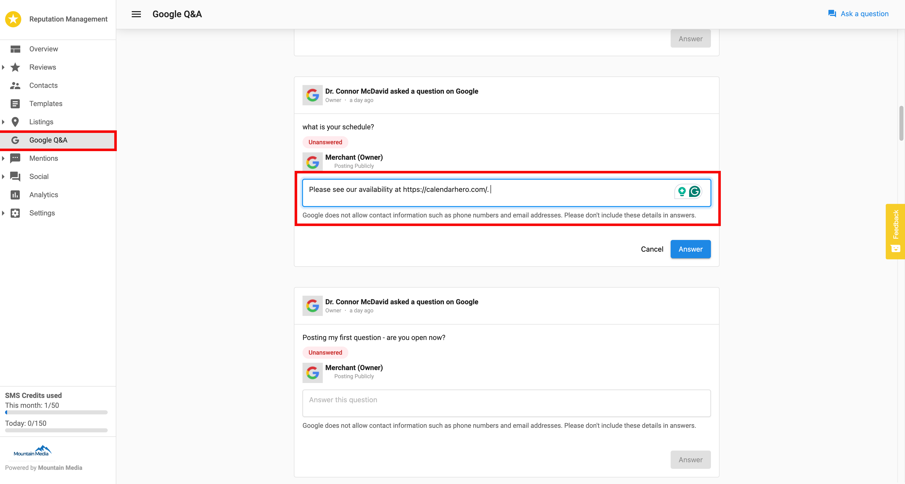

# Does Reputation Management's Google Q&A accept hyperlinks?

**No** - Any hyperlink posted in the answer through Reputation Management will not be sent as a link, but as plain text. At this time, the only way to post hyperlinked answers is to compose and post the answers directly on the Google Business Profile page.

