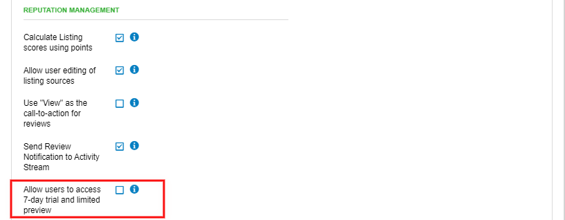
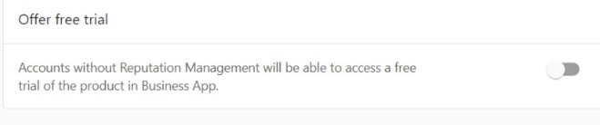

When creating a Snapshot Report for a prospect, the **Reputation Management trial** will be activated. This allows your prospects with access to Business App the ability to work in Reputation Management unrestricted for seven days after the Snapshot Report has been created.

Once the trial has expired, Business App users will still have access to a limited version of Reputation Management. This will allow them to view any data that had been entered previously, but Reputation Management will not check for changes to listings, look for new listings, or pull in any new reviews.

This feature can be toggled on or off via the "Allow users to access 7-day trial and limited preview" option in **Administration > Customize > General Product Settings > Reputation Management section** within Partner Center.

With the feature toggled on anyone with access to Business App will be able to interact with the trial version of Reputation Management, and if the feature is toggled off Reputation Management will not appear.

In addition, under **Marketplace > Products**, "Offer Free Trial" has to be turned on.

