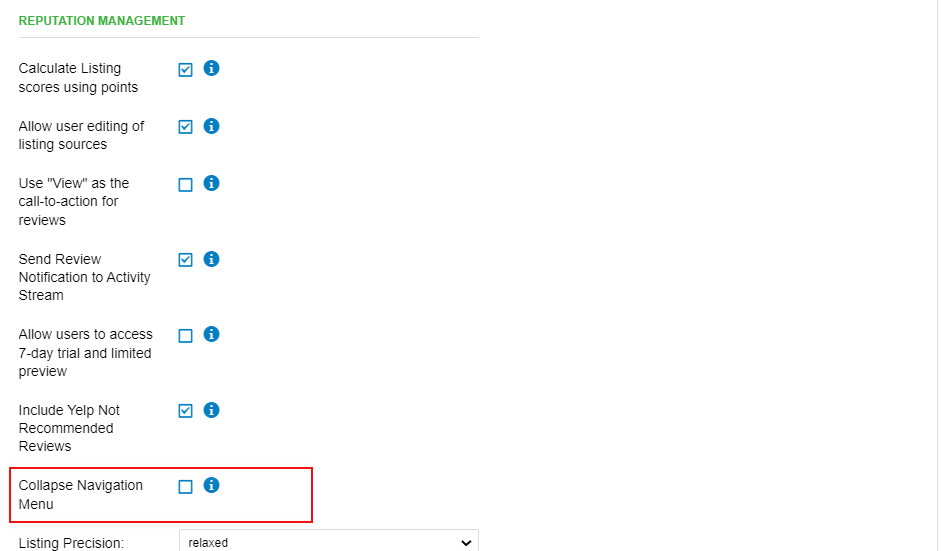

In Partner Center, you can set the default for the Reputation Management navigation panel to collapse by going to **Administration > Customize > General Product Settings > Reputation Management >** check the box next to **'Collapse Navigation Menu'.**

