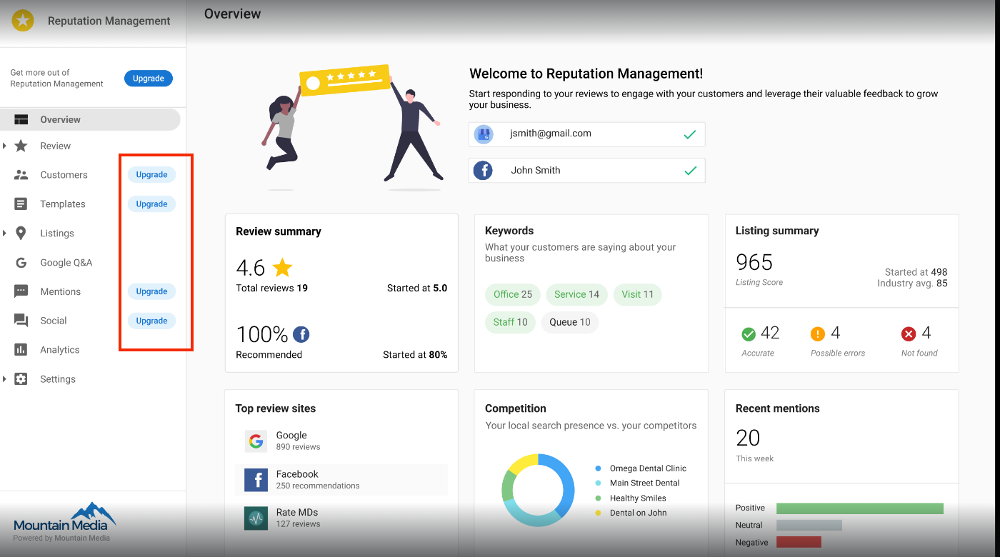
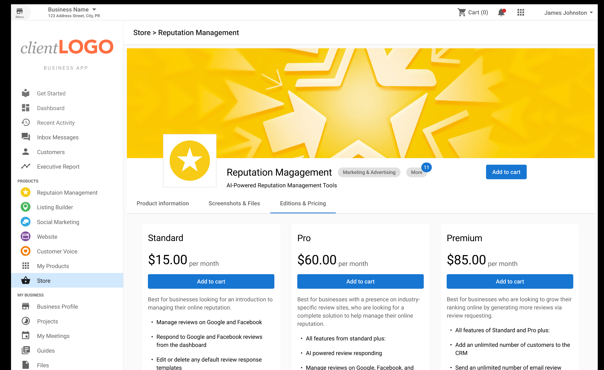
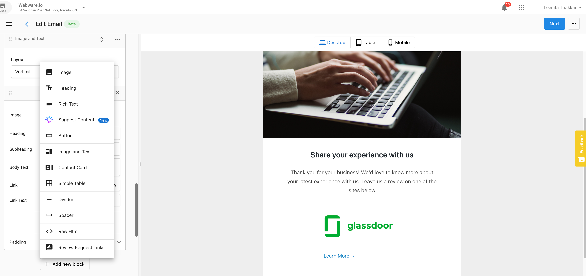

# Reputation Management Premium FAQ

## What is the Premium edition of Reputation Management?

The Premium edition of Reputation Management offers all the features of the Pro edition, plus advanced features including:

- AI-powered review responding
- Review response templates with AI-powered template suggestions
- Review monitoring and responding on the go with our mobile app
- AI-powered social content creation  
- Social calendar view
- Hashtag suggestions
- Email builder

## How do I upgrade to the Premium edition?

If you are currently on the **Standard** edition, you will first need to upgrade to Pro, and then to Premium.

If you are currently on the **Pro** edition, you can upgrade directly to Premium:

## Can I add more listings to my Premium subscription?

Yes, you can add additional listings to your Premium subscription for an additional monthly fee per listing.

## What is the Email Builder?

The Email Builder is a feature exclusive to Premium edition that allows you to easily create and send professional email campaigns to your customers.

## How does the AI-powered review responding work?

With Premium edition, you can use AI to automatically generate personalized responses to customer reviews. The AI takes into account the content of the review, your business information, and best practices for review management to create appropriate responses that you can edit before posting.

## Is the mobile app available for all Reputation Management editions?

No, the mobile app for review monitoring and responding is only available with the Premium edition of Reputation Management.

## How do I get access to the mobile app?

Once you upgrade to the Premium edition, you'll receive instructions on how to download and access the mobile app for iOS and Android devices.