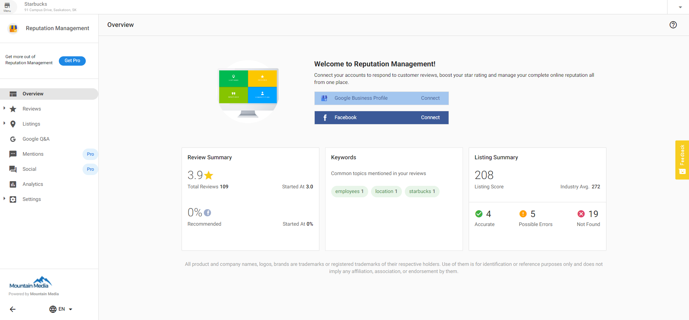
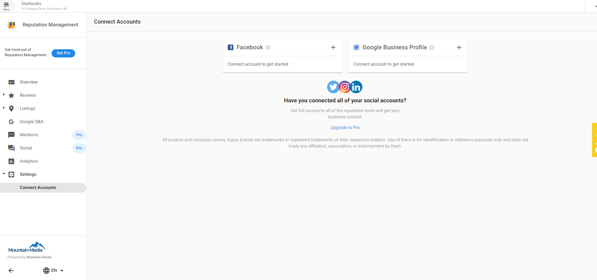

If the listing is found in Reputation Management but the reviews are not showing then Facebook needs to be connected in Reputation Management. 

1. From **Partner Center** > **Accounts** > **Manage Accounts** > Choose **Account**
2. Launch **Reputation Management** > Click Connect next to **Facebook** on the **Overview** tab 

**OR**

Navigate to the **Settings** tab > **Connect Accounts.** Click the **+** icon next to Facebook and follow the prompts to connect Facebook to Reputation Management.

