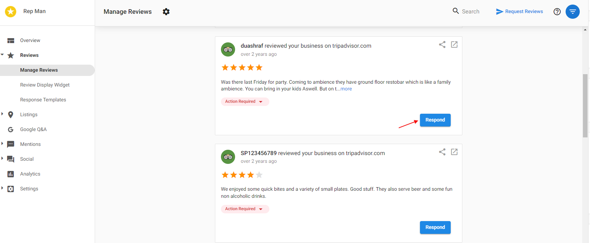

At this time, responding to reviews from the Reputation Management dashboard is only supported for the following review sites:

- Google Business Profile (provided the Google Business Profile account is connected and verified), and the review has not been removed or edited on the Google listing. If the original review cannot be found, it will return an error of "No External ID".
- Facebook (account must be connected for the system to pull in review).
- My Listing page.

For other review sites, clicking on the 'Respond' button will redirect users to the live listing where they can respond to the customer's review.

### **Common Errors**

**Cannot Respond to Google Review**

This issue can occur for a couple of reasons, typically related to how Google Business Profile (GBP) reviews are managed and identified:

1. **Unverified or Duplicate Locations:**
   - If a review is marked as unverified on Google due to being a duplicate of another location, it will not have an external ID.

2. **GBP Management:**
   - The Google Business Profile (GBP) may need to be managed properly to resolve these issues.
   - The team managing the GBP needs to contact Google Business Profile support to resolve duplicates or verify the latest location.

3. **Review Synchronization:**
   - Sometimes, a review may initially lack an external ID if the GBP connection was created after the review was pulled in.

### **Steps to Resolve**

1. **Verify and Resolve Duplicates:**
   - The responsible party managing the GBP should reach out to Google Business Profile support to:
     - Verify any unverified locations.
     - Resolve any duplicate locations.
   - This will ensure all reviews have the necessary external IDs.

2. **Check GBP Connection Timing:**
   - Ensure that the GBP connection is active and properly set up before pulling in reviews.
   - If reviews were imported before the GBP connection was established, re-syncing the reviews might be necessary.

**The external ID does not exist despite the review being present on the live Google Business Profile listing.**

This typically indicates that the client must reconnect their Google Business Profile, as the connection token has likely expired. This situation arises when the individual who initially connected the account is no longer available, or if the connected Google Business Profile user has changed their password.

To address this issue, it is necessary to reconnect the Google Business Profile to respond to the reviews effectively.