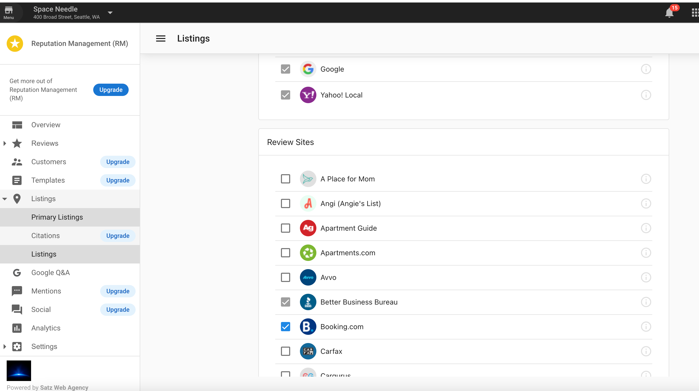

# Why did my listing customizations reset in Reputation Management?

## Overview

Users have the ability to edit which listings show in Reputation Management by checking on/off the boxes under Reputation Management > Listings Tab > Listings.

Any source that has been turned off is an ignored source of the account. Sources that are not available for the account's business category will not show in Reputation Management. Relevant sources to the business category will show unless they are unchecked in the Listings tab.

## What happens if I change the Business Category?

When the business category for an account is changed, the set of listing sources in Reputation Management may be reset. If the new business categories have different set listing sources from the previous business category, the ignored sources will be reset. This means that any source that was turned off manually previous to the category change might be added back if it is a valid source for the new business categories.

For example, when the business categories of an account group were updated from \{Professional Services > Career Guidance Service\} to \{Professional Services > Career Guidance Service, Local Services > Software Developer\}, the sources that are available on the business category would be turned on automatically, and the customizations from previous to the change would be reset.

:::note
If the change was from \{Professional Services > Career Guidance Service\} to another business category under 'Professional Services,' that has the same listing source set, the customizations **will not be undone.**
:::

*We recommend that you revisit the listing sources in Reputation Management to review the source settings whenever the business category is changed.*