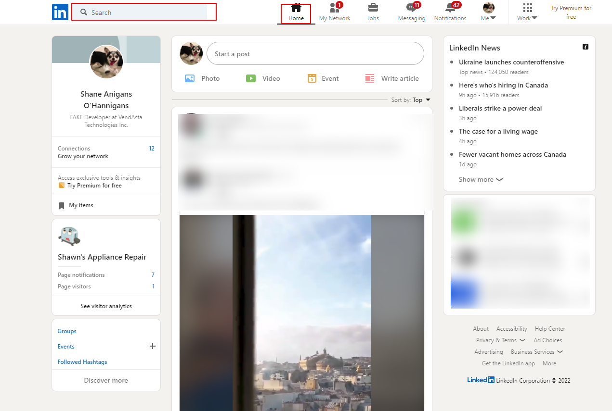
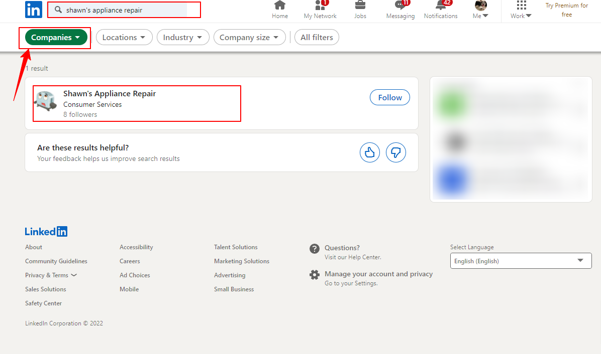
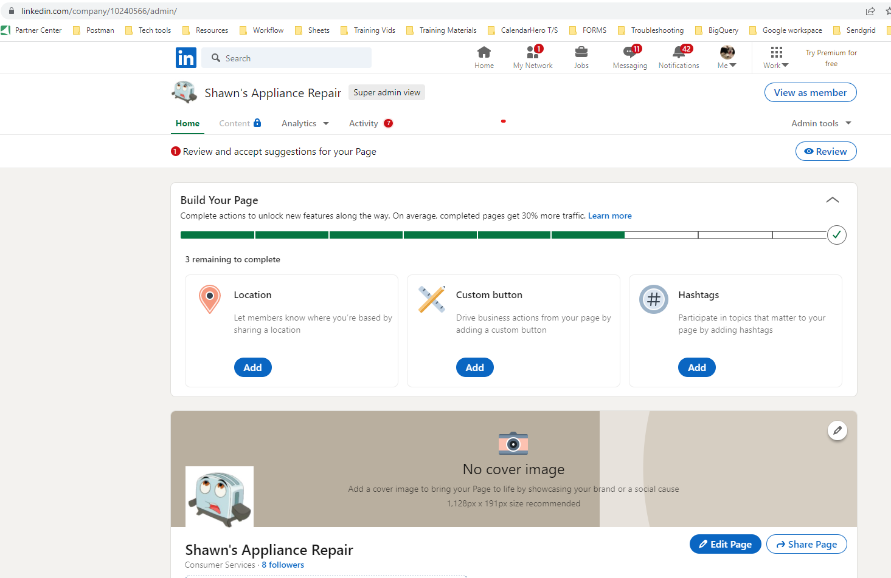

In the primary listings tab in Reputation Management, the **Company Page URL** is required, not a personal page URL. If you try to enter the personal page URL, you will receive an error message. Here is how to get to the Company Page URL:

1) While on the LinkedIn homepage, use the search bar to search for the company's name.

2) Use the filter options to ensure that the correct Organization name is selected.

3) Select the best match, (click claim this page if the page was not claimed before), you should be on the super admin view.

4) Add the URL in the address bar to the Primary Listings tab of Reputation Management.

