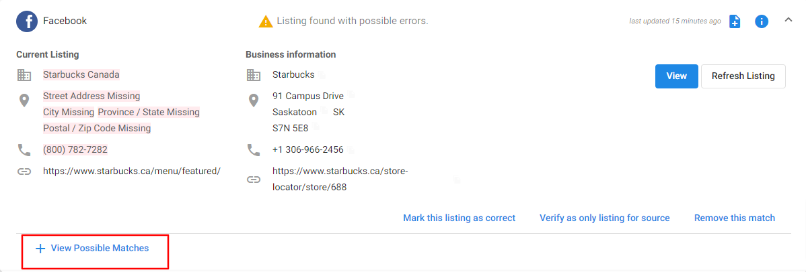

## Why was my existing listing not found?

If you've just created a new listing on a site, Reputation Management should pull it in on its next search. Alternatively, you can add it to Reputation Management manually by selecting **View Possible Matches** under each site and then pasting the URL of your listing. After submitting this link, it may take up to 48 hours for the listing to appear in your Listings list.

It is also possible that we are experiencing issues with a specific source. When a listing source updates its website, there are often changes we need to make on our end to accommodate them. Please take a look at our [Disruption Notices](/vendasta-products/announcements/disruption-notices) to see if there are current issues with any sources.

## Why was my existing Google Maps listing not found?

Reputation Management will automatically search Google Maps to display listings that it believes may belong to the business entered. Occasionally, however, our system will not pull in the Map for that specific listing. This generally happens for one of two reasons:

1. The information provided in the Business Profile is not similar enough to the information on Google Maps as per [Best Match](/vendasta-products/vendasta-products-reputation-management/vendasta-products-reputation-management-faqs/best-match).
2. The listing was created recently and should be automatically pulled in during Reputation Management's next search.

In both of these cases, you can manually add the listing to Reputation Management.

**Steps to follow:**

1. Launch **Reputation Management** > Go to **Listings** tab > Primary Listings
2. Locate **Google** on this page > click on the row to expand it
3. Click on **View Possible Matches**

This will open a window that allows you to search for your business. Once the business name and address have been entered, the system will return the results that it believes are closest to the data entered.

If the business you are searching for does not appear after entering the full business name and address as displayed on Google Maps, there is likely a setting on the listing that is preventing the search tool from locating the Google Maps for the business. In the majority of cases, the business's street address has been suppressed due to being a service area business, and Google is preventing the Map from surfacing.

If the business owner disables the suppression of their Google Maps listing, our system should be able to pull the listing in. Unfortunately, if the business is unable to have its street address appear on Google Maps, our system will be unable to retrieve this listing.

Alternately, authenticating the business's Google Business Profile account by Connecting Google Business Profile within either Reputation Management or the Local SEO product will allow the system to attempt to pull in the Google Maps listing, regardless of whether the address is suppressed.