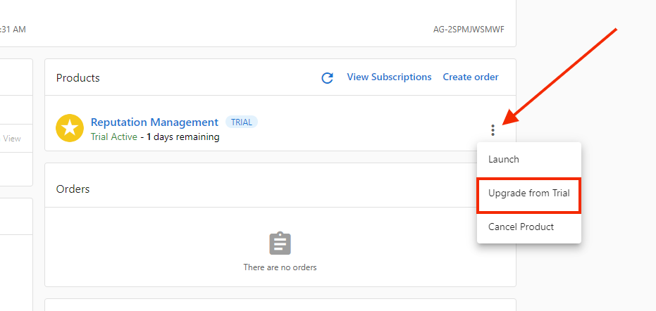

# Upgrading Reputation Management Trial to Paid

When a Snapshot Report is created, a demo version of Reputation Management is activated for 7 days. When a client decides to purchase Reputation Management Standard/Pro/Premium, you will need to convert that trial product to the new edition by following these steps:

1. Visit Partner Center at [partners.vendasta.com](http://partners.vendasta.com)
2. Click the **Accounts tab > Manage Accounts.**
3. Search for the account in question.
4. Once you have located the account you would like to upgrade, click on the account name.
5. Select the three dots menu to the right of the Reputation Management Trial product and click **Upgrade from Trial**.

6. Choose a version of the Reputation Management product.
7. Check the box to consent to charges, then click on **Upgrade to Paid.**