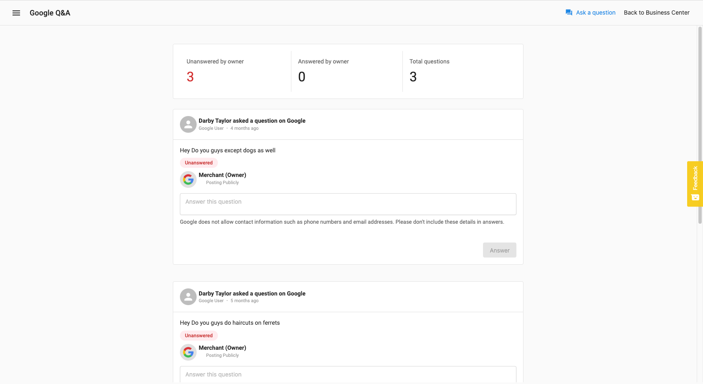
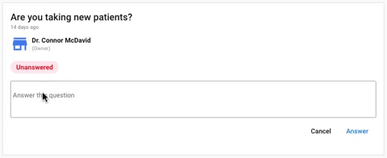

<iframe src="https://www.youtube-nocookie.com/embed/GYwtUmhrnRg" width="560" height="315" frameBorder="0" allowFullScreen></iframe>

You have the ability to monitor all questions and answers from Google Q&A. Respond to questions and ask and answer helpful FAQs for your customers from within Reputation Management.

### Why is Google Q&A important?

Google Q&A is another highly visible way for customers and the public to interact with businesses online. Just like with online reviews, it is important to monitor and respond to Google Q&A activity. Any Google user can write a question and any Google user can answer that question. This makes it lucrative that business owners to be alerted to new questions so they can be the first to respond. Business owners should also populate their Google Q&A with FAQs to answer customer questions in advance.  

**Google Q&A allows the business to:**

- Create meaningful communication with current and potential customers 
- Have an effortless exchange of requests, advice, and help between business owners and consumers
- Highlight a business's most important FAQs to save time for both owners and customers
- Avoid confusing or wrong information about a business
- Capture data about customer needs and desires
- Boost rankings in search results

### How does Google Q&A work?

This feature is available in all Reputation Management. 

Go to **Reputation Management** > **Google Q&A.**

At the top of the page, you will see the total number of questions the business has, the total number of questions that have been answered by the business owner, and the total that have been *un*answered by the business owner.

Below that, you will see a feed of questions and answers. Type an answer into the text field and click **Answer** to have it posted directly to Google. 

To ask a question on Google Q&A, click **Ask a question** in the top right. Type in the question you'd like to ask and click **Submit**. Type the answer to the question into the text field and click **Answer**.