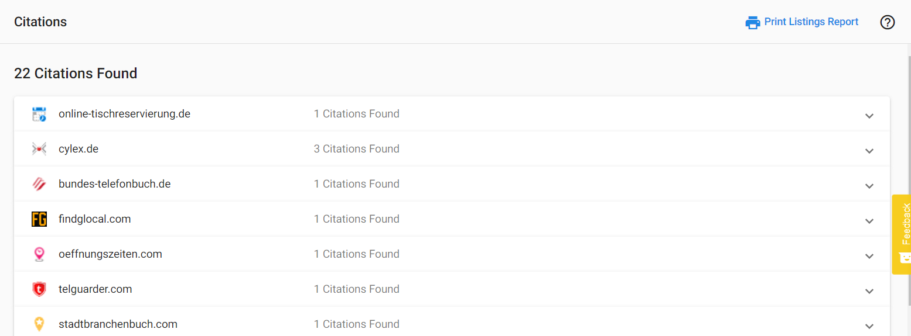

### **What are Citations?**

Citations are mentions of your business name along with another piece of business data (phone number, address, website, etc), and are key in search marketing optimization. Accurate citations help people discover your business, resulting in more web, phone, and foot traffic, which can convert into transactions.

**When search engines like Google rank listings, they consider factors such as:**

- Number of citations
- Accuracy and consistency of data in citations
- Authority of websites where citations appear

The **citations tab in Reputation Management** allows your customers to:
- Monitor all citations pulled in for their business
- Link to the source to view the full citation

**Vendasta uses the following method for searching for citations:**

- We search for various combinations of NAP data to search more effectively
- A search will be run each week so that there is not a large spike in citations, and we continue to find some over time
- Pages that are found, which are not already listings, become citations
- Note that a citation may include a page on the business website if two or more of these conditions exist (phone number + business name or address)

When a business has many listings with consistent listing data, they build a "Citation Effect." Two primary positive outcomes occur from this effect:

- Google's WebCrawler finds the same information in multiple places, adds more confidence to their business data, and
- Good backlinks are created, with more sources that refer to the business's website, which creates better search engine optimization, or SEO.

Citation Builder helps to get the business's information out to the four data aggregators, from which many of these smaller directories will pull information. This will help increase the number of citations over time.