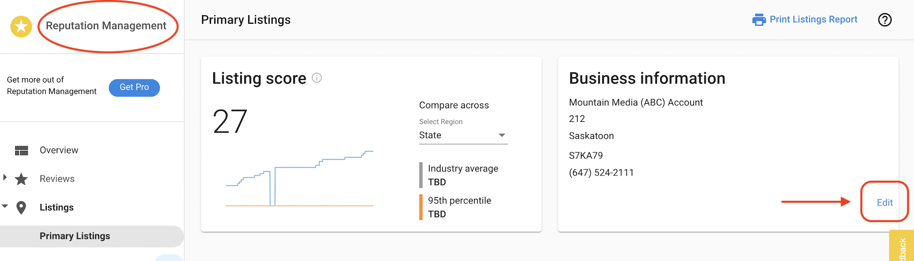
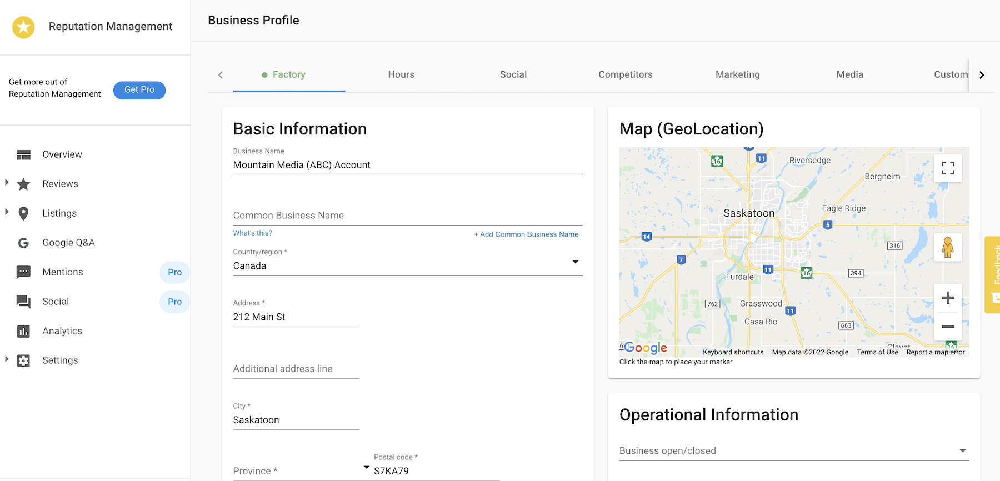

Reputation Management users can easily edit and update their business profile information without being redirected outside of the application.

## Why is editing your business profile in Reputation Management important?

This makes editing the business profile information even easier and quicker with an edit link right on the Primary Listings page within Reputation Management.

## How does editing your business profile from Reputation Management work?

Go to **Business App > Reputation Management > Listings > Edit** to open the business profile and update the information as necessary.

After updating, click the **Save** button at the bottom of the page.   

