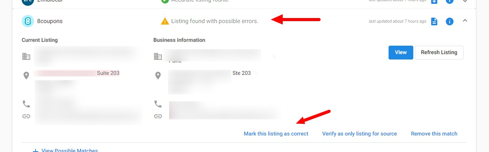
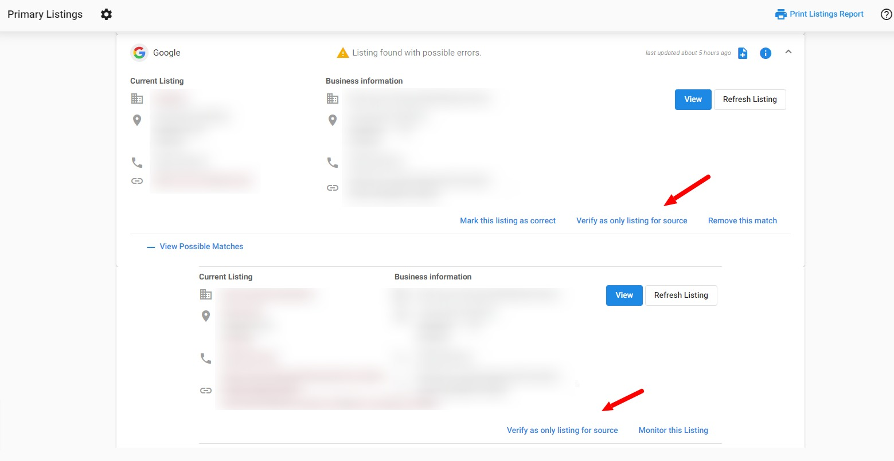
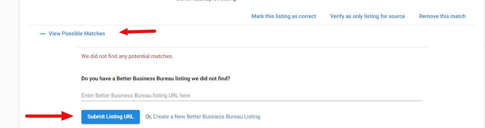

# How to edit and update your Listings

### **When should I use 'Mark this Listing as correct'?**

If the system believes to have pulled in an error for a listing, but the information looks correct to you and you do not want to make any changes, select **Mark this Listing as correct.** When you do that, Reputation Management will no longer check to see if the listing information has changed on that source, so please use this option with caution.

Essentially, this is the same as "Ignoring errors". We recommend using this when Reputation Management is flagging a difference between the live listing and the business profile that is not actually an error (Ex: The live listing shows STE 101 instead of Suite 101). Marking a listing as correct would change the status from "Listing found with possible errors" to "**Accurate listing found**".

### **When should I use 'Verify as only listing for source'?**

Sometimes our Reputation Management web scrapers find multiple possible matches for a correct listing. Perhaps there are 4 different locations for this business, and our system pulls in all of them. This can become tricky if it starts pulling in reviews for all of those possible listing matches as well. Verifying this as the ONLY listing source should make sure that Reputation Management only monitors and brings in reviews for that listing.

### **When should I use 'Remove this match'?**

Similar to the same problem above, perhaps our scrapers have pulled in a listing for a similar yet different listing. If you don't want to monitor that particular listing, you can click 'Remove this match'. It removes the listing from Reputation Management, and then you can either verify the correct listing or enter the URL of the correct live listing if we have not found it, by selecting **View Possible Matches > Submit Listing URL**.

### **When should I use Refresh Listing?**

If you have edited or updated your business profile on a listing source, you can use **Refresh Listing** to manually scan the listing and update your business information in Reputation Management with any new changes that are found. This can be done once every 24 hours.

### **When should I use View Possible Matches?**

You can click on **View Possible Matches** to see a dropdown of listings that the system has pulled in that may belong to your business. Here you can add the listing to your profile by clicking **Monitor this Listing**, or create a new listing or manually submit a listing URL. 

### **Why are my listings still showing as incorrect when they are correct?**

If you've just changed your business information on the listing source, it will take around an hour for the system to re-check the current business data against the listings that were pulled in.

Once a Reputation Management account has been created, we will begin looking for the listing on the selected sources immediately. A source may return several matches, at which point we use Best Match to determine which of the listings are relevant for that business. We schedule searches for new listings on a source every 24 hours for the first 7 days after the profile or source is added. After 7 days, we will check for new listings once per week.

We then check for changes to existing listings every 30 days. We also check for changes when a user logs into their Reputation Management account, up to once per day. When triggered by a login, the next check will be scheduled after 30 days.