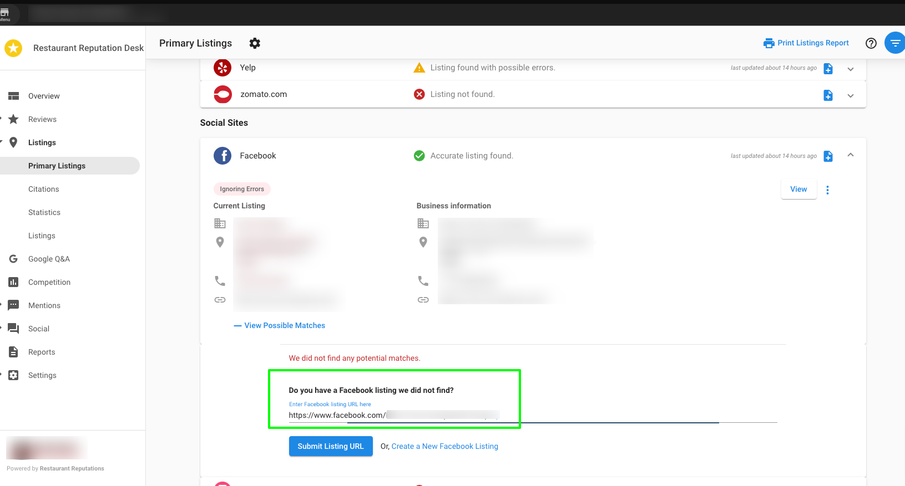
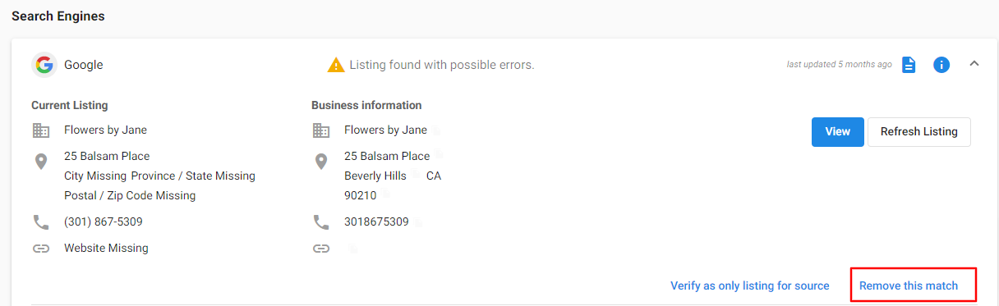
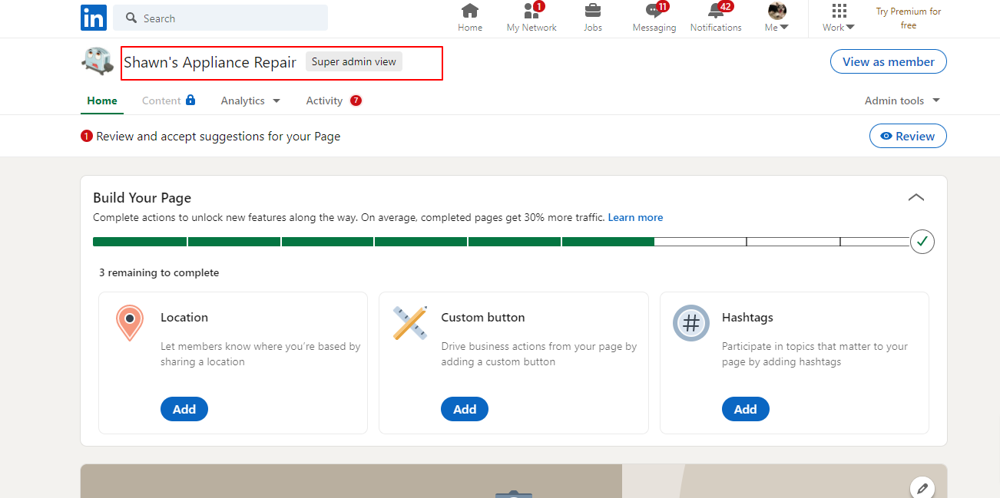

<iframe src="https://www.youtube-nocookie.com/embed/H8H3KgzA480" width="560" height="315" frameborder="0" allowfullscreen></iframe>

# Listings: Getting Started

Welcome to the Listings feature in Reputation Management! This comprehensive guide will help you understand and leverage the power of business listings to improve your online presence and be found before your competitors.

## What are Listings?

Listings in Reputation Management gather all the locations on the web where your business can be found: major search engines, local review sites, online business directories, and social networks. This feature allows you to see where your business is listed, detect and fix any errors, and add new listings to expand your online presence.

## Key Benefits

- **Increased Online Visibility**: Be found online before your competitors
- **Accurate Business Information**: Monitor and maintain consistent business data across platforms
- **Performance Tracking**: Review your Listing Score and compare it to industry averages
- **Error Detection**: Identify and fix inaccuracies in your listings
- **Review Management**: Connect your listings to enable review monitoring and response

## Understanding the Listings Tab

### Primary Listings

The **Primary Listings** tab is your command center for managing your business listings. Here you can:

- **Review your Listing Score** and compare it to industry averages across different regions
- **Monitor your business listings** for accuracy and detect possible errors or missing listings
- **Navigate to source platforms** to view or edit listings directly
- **Refresh listings** to get the most up-to-date information
- **Mark listings as correct** to ignore false error alerts
- **Verify as the only listing** for a source to prevent duplicate results
- **Remove incorrect matches** that don't belong to your business

### How Your Listing Score Works

Your **Listing Score** is an evaluation of your business's accurate Primary Listings and Citations. Each listing source is assigned a score based on the platform's popularity and authority. For example, having an accurate listing on Google Maps carries more weight than smaller directory sites.

**How to Increase Your Listing Score:**
- Ensure your business information is accurate and consistent across all platforms
- Add your business to additional relevant listing sources
- Fix any detected errors in existing listings
- Maintain up-to-date business information

## Understanding Citations

**Citations** are mentions of your business name along with other business data (phone number, address, website, etc.). They're crucial for search marketing optimization and help people discover your business.

Search engines like Google consider these factors when ranking listings:
- Number of citations
- Accuracy and consistency of data in citations  
- Authority of websites where citations appear

Citations result in more web traffic, phone calls, and foot traffic that can convert into transactions.

## How the System Identifies Relevant Listings

Reputation Management uses **Best Match** – an algorithm that determines if a listing belongs to your business profile. Best Match compares your anchor data (Name, Address, Phone Number, and Website) to information found on listings and ranks them based on similarity.

The system weighs different data types with varying importance:
- **Phone Number**: 1.00 (highest weight)
- **Address**: 0.70
- **Zip Code**: 0.55
- **Business Name**: 0.55
- **City**: 0.10 (lowest weight)

A listing must reach a minimum threshold score (typically 50%) to be considered a potential match.

## Key Management Tasks

### Editing and Updating Listings

**Mark this Listing as Correct**: Use this when the system flags an error that isn't actually incorrect. This tells Reputation Management to stop checking for changes on that listing.

**Verify as Only Listing**: Use this to mark a listing as correct and prevent the system from finding additional results for that source.

**Remove Match**: Use this to remove listings that don't belong to your business.

### Adding New Listings

You can manually add listings by:
1. Going to **Listings tab > Primary Listings**
2. Finding the platform you want to add
3. Clicking **View Possible Matches**
4. Submitting your listing URL

### Google Business Profile Authentication

For Google listings, you can authenticate your Google Business Profile to:
- Enable automatic data syncing
- Access advanced listing management features
- Improve the accuracy of listing detection

### Monitoring Trustpilot (Pro Edition)

Pro edition users can monitor Trustpilot listings and reviews, expanding review management capabilities to this popular review platform.

## Customizing Listing Sources

You can control which listing sources appear in Reputation Management by:
1. Going to **Listings tab > Listings**
2. Checking/unchecking boxes next to listing sources
3. Note: Available sources depend on your business category

:::warning Important
If you change your business category, your listing source customizations may reset. Sources appropriate for the new category will be automatically enabled.
:::

## Frequently Asked Questions

### Why are my reviews missing in Reputation Management?

Reviews will only populate if the correct listing is present in Reputation Management. If you have reviews on your live listing but not in the dashboard, the wrong listing was likely pulled in or no listing was found.

**How to fix this:**
- Launch Reputation Management, navigate to **Listings tab > Primary Listings**
- Remove the wrong listing URL if present, then submit the correct URL
- Once the correct page is found, reviews will start populating

### Why are reviews duplicated in Reputation Management?

Duplicate reviews typically occur when a Google account is connected twice in Reputation Management.

**To resolve this:**
1. Click on the Google listing to expand it
2. Click **'Remove this match'** under the duplicate listing
3. Refresh the page

### Why did my listing customizations reset?

When you change your business category, the set of available listing sources may change. If the new business category has different listing sources, your customizations will reset to include all relevant sources for the new category.

**Example**: Changing from "Professional Services > Career Guidance" to "Professional Services > Career Guidance + Local Services > Software Developer" would reset customizations to include sources relevant to both categories.

:::note
If you change to a similar category within the same main category with the same listing sources, customizations will not reset.
:::

**Recommendation**: Review your listing source settings whenever you change your business category.

### Why is Reputation Management not accepting my LinkedIn URL?

Reputation Management requires your **Company Page URL**, not a personal page URL.

**To find your company page URL:**
1. Use LinkedIn's search bar to search for your company name
2. Use filter options to find the correct organization
3. Select the best match (claim the page if unclaimed)
4. Copy the URL from the address bar while on the company page view

### Why was my listing not found?

There are several reasons why a listing might not be found:

**For new listings**: If you recently created a listing, Reputation Management should pull it in during its next search. You can also manually add it using **View Possible Matches**.

**For Google Maps listings**: Our system might not find your listing if:
1. The Business Profile information isn't similar enough to the Google Maps information
2. The listing was created recently and will be found in the next search
3. The business address is suppressed (service area businesses)

**Solutions:**
- Manually add the listing through **View Possible Matches**
- For Google listings, authenticate your Google Business Profile
- Check our Disruption Notices for known issues with specific sources

**For service area businesses**: If your Google Maps address is suppressed, our system may be unable to retrieve the listing. Authenticating your Google Business Profile can help in these cases.

## Next Steps

Now that you understand the basics of Listings in Reputation Management, explore these advanced topics:

- [Detailed Listings Tab Guide](listings-tab)
- [How to Edit and Update Listings](edit-update-listings)
- [Understanding Listing Score Calculation](listing-score-calculation)
- [Google Business Profile Authentication](how-to-authenticate-google-business-profile-listing)
- [Citations Page Overview](citations-page-getting-started)

Ready to optimize your online presence? Start by reviewing your Primary Listings and ensuring all your business information is accurate and consistent across platforms! 