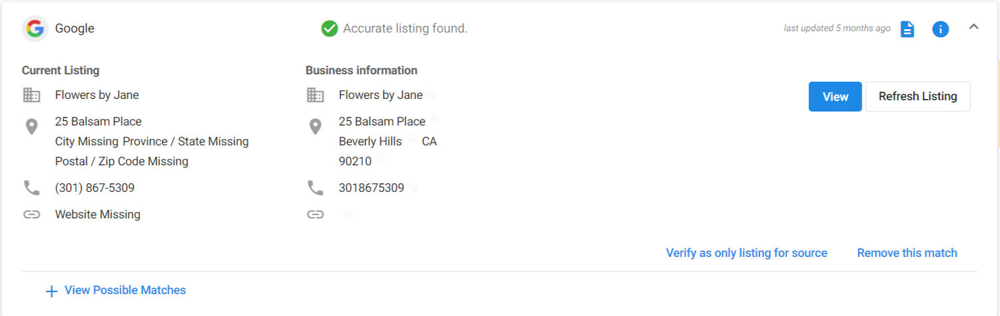
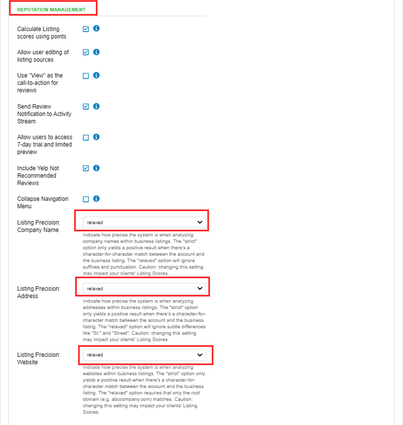
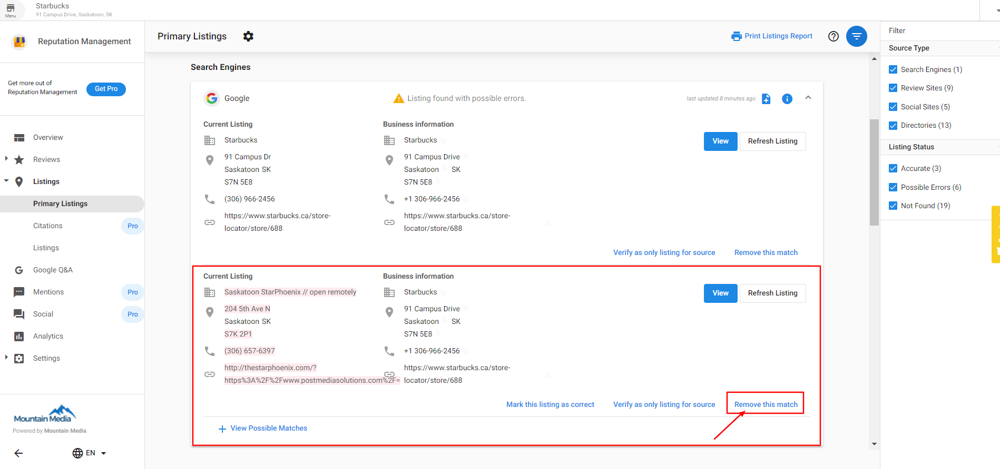
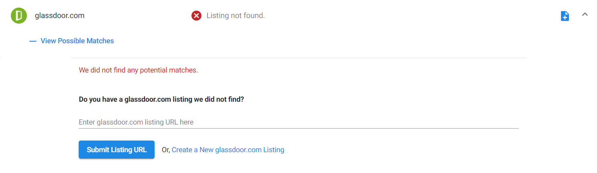

# Listings: Getting Started

Welcome to the Listings feature in Reputation Management! 
## What are Listings?

Listings in Reputation Management gather all the locations on the web where your business can be found: major search engines, local review sites, online business directories, and social networks. This feature allows you to see where your business is listed, detect and fix any errors, and add new listings to expand your online presence.

## Key Benefits

- **Increased Online Visibility**: Be found online before your competitors
- **Accurate Business Information**: Monitor and maintain consistent business data across platforms
- **Performance Tracking**: Review your Listing Score and compare it to industry averages
- **Error Detection**: Identify and fix inaccuracies in your listings
- **Review Management**: Connect your listings to enable review monitoring and response

## Understanding the Listings Tab

### Primary Listings

The **Primary Listings** tab is your command center for managing your business listings. Here you can:

- **Review your Listing Score** and compare it to industry averages across different regions
- **Monitor your business listings** for accuracy and detect possible errors or missing listings
- **Navigate to source platforms** to view or edit listings directly
- **Refresh listings** to get the most up-to-date information
- **Mark listings as correct** to ignore false error alerts
- **Verify as the only listing** for a source to prevent duplicate results
- **Remove incorrect matches** that don't belong to your business

### How Your Listing Score Works

Your **Listing Score** is an evaluation of your business's accurate Primary Listings and Citations. Each listing source is assigned a score based on the platform's popularity and authority. For example, having an accurate listing on Google Maps carries more weight than smaller directory sites.

**How to Increase Your Listing Score:**
- Ensure your business information is accurate and consistent across all platforms
- Add your business to additional relevant listing sources
- Fix any detected errors in existing listings
- Maintain up-to-date business information

## Understanding Citations

**Citations** are mentions of your business name along with other business data (phone number, address, website, etc.). They're crucial for search marketing optimization and help people discover your business.

Search engines like Google consider these factors when ranking listings:
- Number of citations
- Accuracy and consistency of data in citations  
- Authority of websites where citations appear

Citations result in more web traffic, phone calls, and foot traffic that can convert into transactions.

## How the System Identifies Relevant Listings

Reputation Management uses **Best Match** – an algorithm that determines if a listing belongs to your business profile. Best Match compares your anchor data (Name, Address, Phone Number, and Website) to information found on listings and ranks them based on similarity.

The system weighs different data types with varying importance:
- **Phone Number**: 1.00 (highest weight)
- **Address**: 0.70
- **Zip Code**: 0.55
- **Business Name**: 0.55
- **City**: 0.10 (lowest weight)

A listing must reach a minimum threshold score (typically 50%) to be considered a potential match.

## Key Management Tasks

### Editing and Updating Listings

**Mark this Listing as Correct**: Use this when the system flags an error that isn't actually incorrect. This tells Reputation Management to stop checking for changes on that listing.

**Verify as Only Listing**: Use this to mark a listing as correct and prevent the system from finding additional results for that source.

**Remove Match**: Use this to remove listings that don't belong to your business.

### Adding New Listings

You can manually add listings by:
1. Going to **Listings tab > Primary Listings**
2. Finding the platform you want to add
3. Clicking **View Possible Matches**
4. Submitting your listing URL

### Google Business Profile Authentication

For Google listings, you can authenticate your Google Business Profile to:
- Enable automatic data syncing
- Access advanced listing management features
- Improve the accuracy of listing detection

### Monitoring Trustpilot (Pro Edition)

Pro edition users can monitor Trustpilot listings and reviews, expanding review management capabilities to this popular review platform.

## Customizing Listing Sources

You can control which listing sources appear in Reputation Management by:
1. Going to **Listings tab > Listings**
2. Checking/unchecking boxes next to listing sources
3. Note: Available sources depend on your business category

:::warning Important
If you change your business category, your listing source customizations may reset. Sources appropriate for the new category will be automatically enabled.
:::

## Frequently Asked Questions

Why are my reviews missing in Reputation Management?

Reviews will only populate if the correct listing is present in Reputation Management. If you have reviews on your live listing but not in the dashboard, the wrong listing was likely pulled in or no listing was found.

**How to fix this:**
- Launch Reputation Management, navigate to **Listings tab > Primary Listings**
- Remove the wrong listing URL if present, then submit the correct URL
- Once the correct page is found, reviews will start populating

Why are reviews duplicated in Reputation Management?

Duplicate reviews typically occur when a Google account is connected twice in Reputation Management.

**To resolve this:**
1. Click on the Google listing to expand it
2. Click **'Remove this match'** under the duplicate listing
3. Refresh the page

Why did my listing customizations reset?

When you change your business category, the set of available listing sources may change. If the new business category has different listing sources, your customizations will reset to include all relevant sources for the new category.

**Example**: Changing from "Professional Services > Career Guidance" to "Professional Services > Career Guidance + Local Services > Software Developer" would reset customizations to include sources relevant to both categories.

:::note
If you change to a similar category within the same main category with the same listing sources, customizations will not reset.
:::

**Recommendation**: Review your listing source settings whenever you change your business category.

How is the point-based Listing Score calculated?

With data from reputable sources such as Alexa and Moz, we identified the [Top 100 Online Business Directories](https://www.vendasta.com/blog/top-100-online-business-directories/). We then assigned scores to each site based on its popularity (i.e. **Popular sites like Google Maps will have a greater influence on the Listing Score**). You are also able to adjust whether your listing score is calculated based on the world, country, state/province, or city-level comparisons of the industry average. This allows you to broaden, or narrow your results to better suit your client's location.

We assess the accuracy of your clients' listings on the top 30 sites and adjust the score accordingly:

- Good match = 100% of assigned points 
- Partial Match = Partial assigned points 

The remainder of sites in the top 100 is assigned a score of five, regardless of accuracy, and all sites outside of the top 100 are assigned a score of two, regardless of accuracy. **This includes some Primary Listings and Other Citations. The one exception to this is Foursquare, which is a top 100 listing but is assigned a score of two, regardless of accuracy.**

**Please be aware that adding and removing sources in Reputation Management may result in an account's score changing.**

Removed sources are not included in the Listing Score calculation, which may cause the score to drop.

Newly enabled sources where listings are found will cause the score to increase.

Why is Reputation Management not accepting my LinkedIn URL?

Reputation Management requires your **Company Page URL**, not a personal page URL.

**To find your company page URL:**
1. Use LinkedIn's search bar to search for your company name
2. Use filter options to find the correct organization
3. Select the best match (claim the page if unclaimed)
4. Copy the URL from the address bar while on the company page view

Why was my listing not found?

There are several reasons why a listing might not be found:

**For new listings**: If you recently created a listing, Reputation Management should pull it in during its next search. You can also manually add it using **View Possible Matches**.

**For Google Maps listings**: Our system might not find your listing if:
1. The Business Profile information isn't similar enough to the Google Maps information
2. The listing was created recently and will be found in the next search
3. The business address is suppressed (service area businesses)

**Solutions:**
- Manually add the listing through **View Possible Matches**
- For Google listings, authenticate your Google Business Profile
- Check our Disruption Notices for known issues with specific sources

**For service area businesses**: If your Google Maps address is suppressed, our system may be unable to retrieve the listing. Authenticating your Google Business Profile can help in these cases.

How does the system identify relevant listings?

We use **Best Match** – an algorithm that determines if a listing belongs to a business' profile. Best Match compares the anchor data (Name, Address, and Phone Number plus Website) to the information found on the listing, determines if a listing is worth considering, and then ranks the listing on how closely it matches the anchor data.

A listing's page is determined as a "potential listing" if the best match score reaches a threshold. By default, this is 50% (140), but on some sources, we expect a better score or don't expect as high a score. For example, X pages don't allow users to enter much information, so its threshold is quite low. Whereas Yahoo! Local has a lot of information and is usually quite accurate, its threshold is rather high. If none of the listings returned in the search reach the threshold, there is no Best Match, otherwise, the highest-scored listing (or listings in the case of a tie) are the Best Match listing(s).

The best match considers phone, name, city, zip/postal, and address independently and scores the match between 0% and 100% for each. Each type of data has a different weighting on the Best Match result:

- **Phone:** 1.00
- **Name:** 0.55
- **City:** 0.10
- **Zip:** 0.55
- **Address:** 0.70

A phone number has the most influence and the city has the least. A perfect score is 290, but if there are multiple listings above the threshold, all listings with scores greater than 90% of the listing with highest score will have a tie since a profile could legitimately have multiple listings on a site and any listings with such similar high scores are likely real listings.

The match may also be dependent on if your Visibility settings are **Strict or Relaxed** in your Listing Precision settings.

Note that if a listing has recently been updated, and information matches, but is still marked as red, it is because Best Match has yet to run. It should run shortly after the listing updates, and the red marking will disappear within 30m.

What is the difference between Relaxed and Strict listing settings?

**Relaxed Visibility** means that listings brought into Reputation Management, or displayed in the Citation Builder chart in Listing Builder will be marked as "Correct" when an exact match is found AND when a close match is found. For Addresses close matches include commonly abbreviated terms, for example, "St." instead of "Street", or "W" instead of "West." Secondary Unit Designation will also be affected. For example, if the address on an Account has no Secondary Unit such as a suite number, and a listing has the same address, but also a Secondary Unit Designation, that will be considered a match.

The system will also verify if the listing's top-level website/domain is correct (i.e: www.vendasta.com) without looking at specific URL paths (www.vendasta.com/platform). The Relaxed setting is fine for most situations, but for optimal SEO businesses should choose Strict Visibility.

**Strict Visibility** means that online listings will be marked as "Found" only when an exact match is discovered. Close matches will not be accepted. The system will mark a listing as "Found With Possible Errors" if it is listed as "ABC St." instead of "ABC Street," or "XYZ Cres." instead of "XYZ Crescent." The full URL must be correct as well. Strict Visibility is optimal for SEO.

How does Reputation Management determine if a listing belongs to a business?

We use Best Match—an algorithm that compares the business name, address, phone number, and website to the information found on the listing—to determine if a listing is relevant to a business. Should this process find a potential listing that is relevant to the business, it will appear in Reputation Management.

All sources with enough information to match the anchor data will be ranked and considered as "potential listings." This means that some listings may be pulled in that do not belong to that given business. The unrelated listings will be considered relevant until they have been reviewed and selected as "not mine," by the user. This can be done in the Listings tab of Reputation Management.

This is why it is important to audit the listings before sending or sharing Snapshot Reports and before walking a new client through the Reputation Management dashboard.

How can incorrect listings or reviews affect my business profile?

Incorrect listings or reviews can impact your business profile in several ways:

1. An incorrect listing or a review from an unrelated business may show up in the Snapshot Report
2. A review for an unrelated business is pulled into Reviews in Reputation Management
3. An unrelated business listing is pulled into Listings in Reputation Management

How do I remove incorrect listings or reviews?

To remove incorrect listings or reviews:

1. Open the **Reputation Management** account
2. Go to the **Listings** tab
3. Review all of the listings. If you find a listing that doesn't belong to the business, click the menu and click **Remove this match**

What happens after I remove an incorrect listing?

After removing an incorrect listing, you can expect:

- The Snapshot Report, ***if still active***, will update within 24 hours
- If the Snapshot Report needs to be viewed before the update takes place, you can manually remove the particular source with the incorrect listing from the report
- Unrelated reviews in Reputation Management will be immediately removed
- The unrelated listing will no longer be monitored

How do I manually add a Listing by submitting the listing URL?

**Steps to Follow:**

1. Go to **Reputation Management > Listings > Primary Listings.**
2. Click on the Listing Source where you would like to add a listing.
3. Click on the dropdown to see more details, then click on **View Possible Matches**. Here you will see a dropdown menu where you can enter the listing URL. Click on Submit Listing URL, or alternatively, Create New Listing to navigate to that listing source and create a new listing.

Why is my manually added listing not appearing yet?

Once you've added a URL, it can take up to 48 hours to process the new listing.

Why am I getting an error when trying to add a listing URL?

An error may occur if we have suspended a source. You can check out our current source disruptions to see if we are experiencing an issue with your specific source. If the source is not suspended, the issue could be with the type of URL you're trying to submit. For example, you will receive an error when you submit a search string instead of the actual listing page. Please see below for a list of common URL submission errors on specific sources.

**Facebook**

If the Facebook Page has a restriction (i.e. country or age restrictions), Facebook will not send it through their API. If you are a manager of the Facebook Page, please edit the privacy settings and remove the restriction. This will allow the page to be sent via their API and will resolve the issue.

You can test to see if the Facebook page you are trying to add is restricted by copying and pasting the Facebook page URL into an incognito browser window. If the page has a restriction, you will be prompted to log in to see the page. You may also see a page that indicates the page does not exist.

**To Remove Country Restrictions:**

- Once logged into Facebook, go to your Business Page to access the Admin Panel.
- Click on **Settings.**
- Click **General >** click **Country Restrictions.**
- Ensure that your Country's Restrictions are visible to everyone.

**LinkedIn**

Please make sure that the URL you are trying to add is for a Company page and not a Profile page. The LinkedIn URL field is programmed only to access Company page URLs.

If you would like to add a personal LinkedIn account to the Reputation Management product, you can add it under both the **Competition** and **Social** tabs.

***How to tell the difference:***

A company page will have the format https://www.linkedin.com/company/... OR https://www.linkedin.com/company-beta/...

A personal page will have the format: https://www.linkedin.com/in/...

For more information on setting up a company page check out the 'Manage your Company Page' section in the LinkedIn Help Center: https://www.linkedin.com/help/linkedin/topics/6227/6228.

