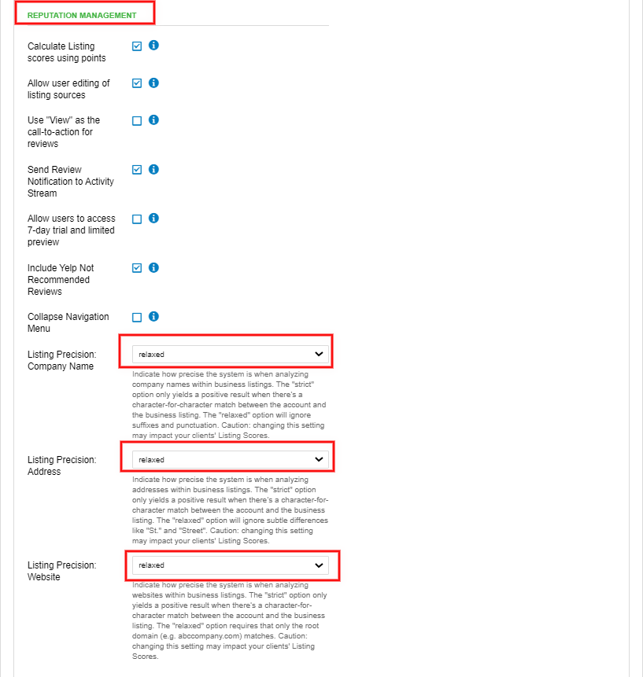

## How does the system identify relevant listings?

We use Best Match – an algorithm that determines if a listing belongs to a business' profile. Best Match compares the anchor data (Name, Address, and Phone Number plus Website) to the information found on the listing, determines if a listing is worth considering, and then ranks the listing on how closely it matches the anchor data.

A listing's page is determined as a "potential listing" if the best match score reaches a threshold. By default, this is 50% (140), but on some sources, we expect a better score or don't expect as high a score. For example, X pages don't allow users to enter much information, so its threshold is quite low. Whereas Yahoo! Local has a lot of information and is usually quite accurate, its threshold is rather high. If none of the listings returned in the search reach the threshold, there is no Best Match, otherwise, the highest-scored listing (or listings in the case of a tie) are the Best Match listing(s).

The best match considers phone, name, city, zip/postal, and address independently and scores the match between 0% and 100% for each. Each type of data has a different weighting on the Best Match result:

- **Phone:** 1.00
- **Name:** 0.55
- **City:** 0.10
- **Zip:** 0.55
- **Address:** 0.70

A phone number has the most influence and the city has the least. A perfect score is 290, but if there are multiple listings above the threshold, all listings with scores greater than 90% of the listing with highest score will have a tie since a profile could legitimately have multiple listings on a site and any listings with such similar high scores are likely real listings.

The match may also be dependent on if your Visibility settings are **Strict or Relaxed** (Partner Center > Administration > Customize > General Product Settings > Reputation Management > Listing Precision). Watch the video of these steps below.

Note that if a listing has recently been updated, and information matches, but is still marked as red, it is because Best Match has yet to run. It should run shortly after the listing updates, and the red marking will disappear within 30m.

## What is the difference between Relaxed and Strict listing settings?

**Relaxed Visibility** means that listings brought into Reputation Management, or displayed in the Citation Builder chart in Listing Builder will be marked as "Correct" when an exact match is found AND when a close match is found. For Addresses close matches include commonly abbreviated terms, for example, "St." instead of "Street", or "W" instead of "West." Secondary Unit Designation will also be affected. For example, if the address on an Account has no Secondary Unit such as a suite number, and a listing has the same address, but also a Secondary Unit Designation, that will be considered a match.

The system will also verify if the listing's top-level website/domain is correct (i.e: www.vendasta.com) without looking at specific URL paths (www.vendasta.com/platform). The Relaxed setting is fine for most situations, but for optimal SEO businesses should choose Strict Visibility.

**Strict Visibility** means that online listings will be marked as "Found" only when an exact match is discovered. Close matches will not be accepted. The system will mark a listing as "Found With Possible Errors" if it is listed as "ABC St." instead of "ABC Street," or "XYZ Cres." instead of "XYZ Crescent." The full URL must be correct as well. Strict Visibility is optimal for SEO.

The casing will not be affected. Ex. Vendasta and Vendasta would still be marked as correct.

- Punctuation will be marked as incorrect, except for a period. Ex. Vendasta's and Vendastas would be incorrect.
- Vendasta Inc. and Vendasta Inc would be correct.

All new partners are set to Relaxed Visibility by default. If you wish to change to Strict Visibility, in **Partner Center > Administration > Customize > Reputation Management > Listing Precision.**

### Watch the video of these steps here.

<iframe src="https://drive.google.com/file/d/1LYAHhD15WmBQDYHng47ufnYu_CsDy-Oc/preview" width="640" height="480" allowFullScreen></iframe>