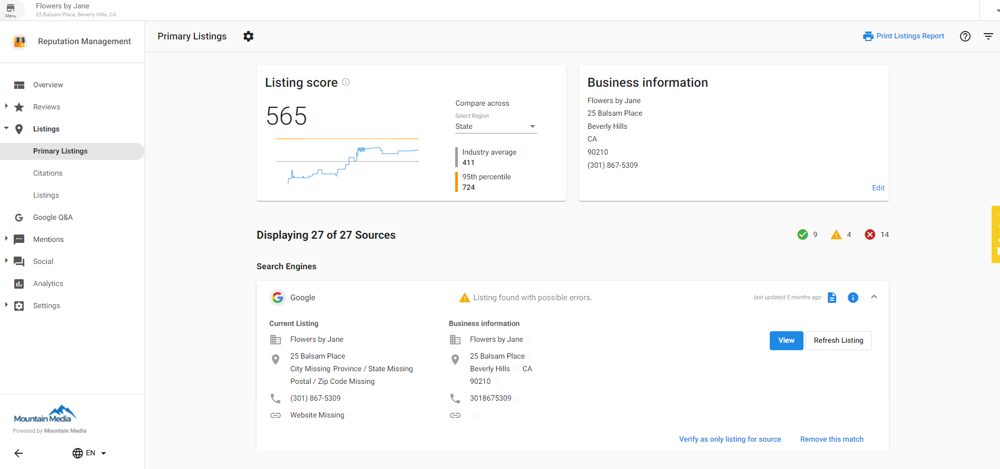
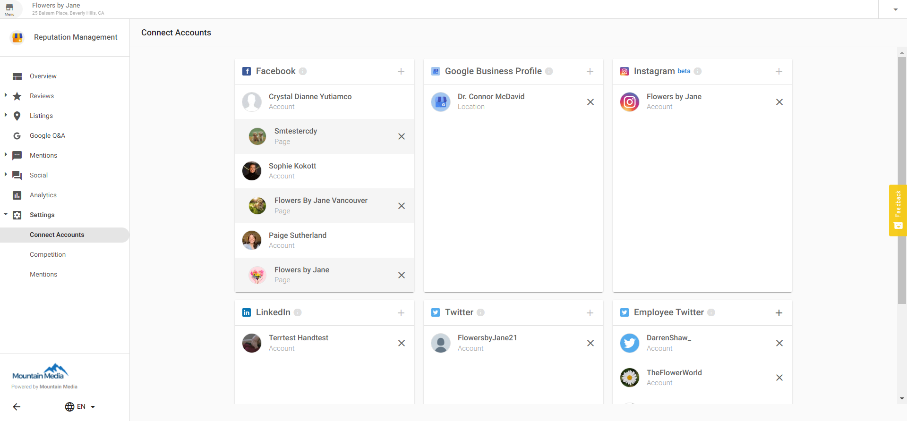
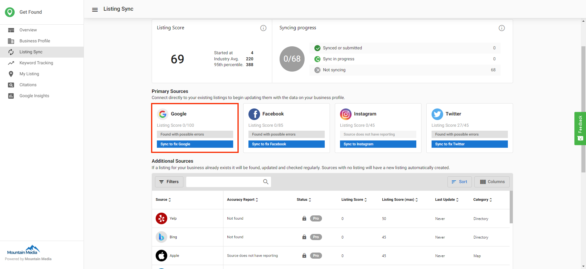

There are three places where you can connect a Google Business Profile account in the platform. Once you've connected a Google Business Profile account in one of these three areas, it will be connected in all of them.

## To authenticate a Google Business Profile account in Reputation Management:

1. Go to the **Listings tab** of Reputation Management.
2. Click the Google listing. In the dropdown, click **View Possible Matches.**
3. Click **Connect Google Business Profile.**

4. Log into your Google account and select a location (this location must be verified on Google).

## To authenticate a Google Business Profile account in Reputation Management Settings:

Connect a Google Business Profile account in **Reputation Management > Settings > Connect Accounts**

## To authenticate a Google Business Profile account in Local SEO > Listing Sync:

1. Go to the **Listing Sync** tab in **Local SEO**.
2. Click **Sync to fix Google** on the **Google** listing source.
3. Authenticate a Google account.
4. Select a Google business listing. The Google account must already have access to this listing.
5. Click **Turn on Syncing** to sync to the Google Business Profile within seconds.
6. You must verify the listing in the Google Business Profile dashboard for changes to display on Maps, Search, and other Google services. Follow [these instructions](https://support.google.com/business/answer/2911778?hl=en).
7. Changes to location info via Business App or Partner Center will automatically syndicate to Google Business Profile!

Contact support@vendasta.com if you experience any trouble completing the steps above.