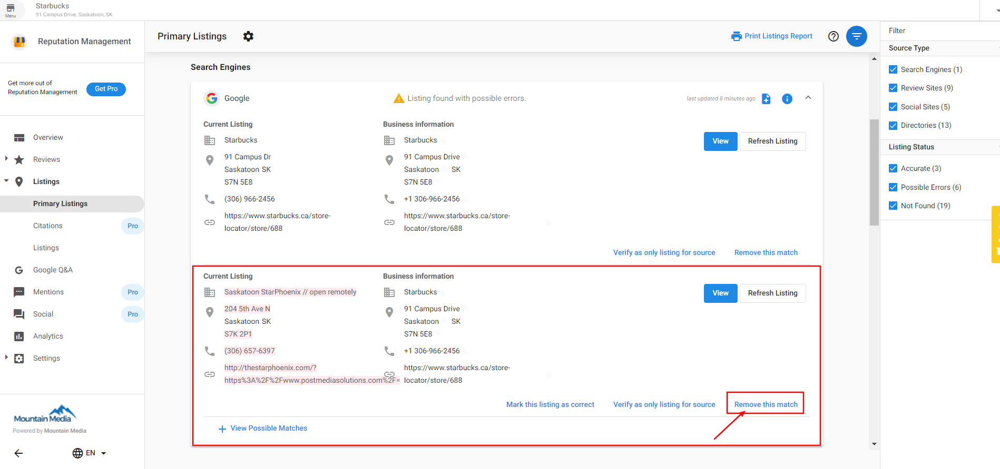

## How does Reputation Management determine if a listing belongs to a business?

We use Best Match—an algorithm that compares the business name, address, phone number, and website to the information found on the listing—to determine if a listing is relevant to a business. Should this process find a potential listing that is relevant to the business, it will appear in Reputation Management.

## How does it work?

All sources with enough information to match the anchor data will be ranked and considered as "potential listings." This means that some listings may be pulled in that do not belong to that given business. The unrelated listings will be considered relevant until they have been reviewed and selected as "not mine," by the user. This can be done in the Listings tab of Reputation Management.

This is why it is important to audit the listings before sending or sharing Snapshot Reports and before walking a new client through the Reputation Management dashboard.

You can read more about this process here: [How Best Match compares business information to potential listings.](how-system-identifies-relevant-listings)

## How can incorrect listings or reviews affect the business profile?

1. An incorrect listing or a review from an unrelated business may show up in the Snapshot Report
2. A review for an unrelated business is pulled into Reviews in Reputation Management
3. An unrelated business listing is pulled into Listings in Reputation Management

## What you can do:

1. Open the **Reputation Management** account.
2. Go to the **Listings** tab.
3. Review all of the listings. If you find a listing that doesn't belong to the business, click the menu and click **Remove this match**.

## What you can expect:

- The Snapshot Report, ***if still active***, will update within 24 hours
  - If the Snapshot Report needs to be viewed before the update takes place, you can manually remove the particular source with the incorrect listing from the report. Learn how to edit the Snapshot Report here: [How to Customize a Snapshot Report](../../snapshot-reports/how-to-customize-a-snapshot-report)
- Unrelated reviews in Reputation Management will be immediately removed
- The unrelated listing will no longer be monitored.