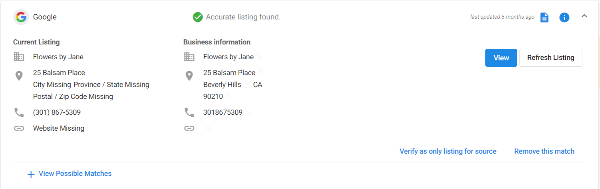

<iframe src="https://www.youtube-nocookie.com/embed/H8H3KgzA480" width="560" height="315" frameborder="0" allowfullscreen></iframe>

### **Listings**

Be found online before your competitors. Listings in Reputation Management gather all the locations on the web where your client's business listing can be found: major search engines, local review sites, online business directories, and social networks. This feature allows you to see where the business is listed, detect and fix any errors or add new listings. 

The **Primary Listings** tab allows your customers to:

- Review their Listing Score and compare it to the industry average and across different regions
- Monitor their business's online listings for accuracy and to detect possible errors or missing listings
- Navigate to the appropriate source to view or edit that listing
- **Refresh the listing** to refresh with the most up to date changes
- Choose to **Mark this listing as correct** to ignore false errors
- **Verify as the only listing for source** to mark the listing as correct and stop the system from fetching other results
- **Remove this match** if the listing pulled in does not belong to their business

[View our video walkthrough to learn how to manage listings in the Primary Listings tab.](#h_01G7CNPWJHXJWSWPQSJNJ6JHQG)

The **Listing Score** is an evaluation of your business's accurate Primary Listings and Citations. Each listing source is assigned a score based on how popular the site is. 

For example, having an accurate listing on a popular site like Google Maps will have a greater influence on your Listing Score.

### **How To Increase Your Listing Score:**

- Verify your listings
- Fix any found errors in the Primary Listings tab
- Create new listings and citations

### **How To Verify Your Listings:**

1. Go to **Reputation Management** > **Listings > Listings subtab** and check that the listing sources relevant to your business have been selected.
2. Go to the Primary Listings page and review all of the listings that have been found for your business. Here you can check for potential errors and edit the listing if needed.

**Showing the date when the listing was last updated**

Beside each listing in **Reputation Management** > **Listings,** you'll see the date or time when the listing was last updated. This will only occur on listings that are 'found as accurate' or 'found with possible errors'. 

This will increase confidence in your SMB clients that the listing information portrayed is up to date. To refresh the listing, click  and click **Refresh Listing**.

**Showing when a listing is potentially missing (Reputation Management and Multi-Location Business App)**

Besides listings in **Reputation Management** > **Listings**, and **Multi-Location Business App** > **Listings** you may see a small badge indicating that the listing is 'Potentially Missing'. This will be shown when a listing can no longer be found and it is suspected that it was removed or is otherwise missing from the source.

***What should your client do?*** Click **View** to confirm that the listing is missing. If it is missing, click **Remove listing**. 

This will alert your SMB clients if a listing was removed from the source so that once a new listing is created, it can be properly monitored once again.

### **Citations**

The citations that our system pulls in are mentions of your business name along with another piece of business data (phone number, address, website, etc), and are key in search marketing optimization. Accurate citations help people discover your business, resulting in more web, phone, and foot traffic, which can convert into transactions. 

When search engines like Google rank listings, they consider factors such as:

- Number of citations
- Accuracy and consistency of data in citations
- Authority of websites where citations appear

The **Citations** tab allows your customers to:

- Monitor all citations pulled in for their business
- Link to the source to view the full citation

