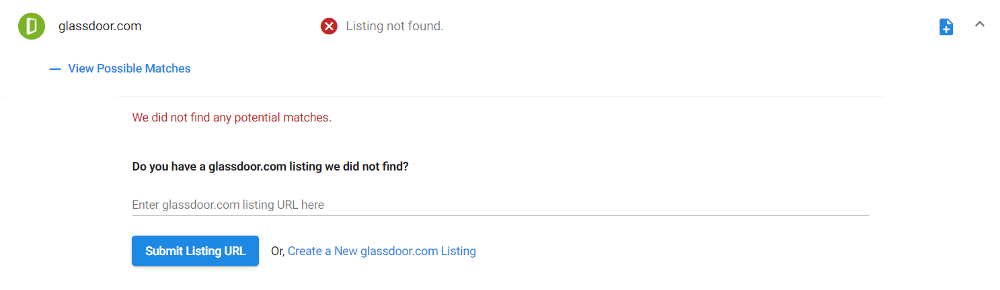
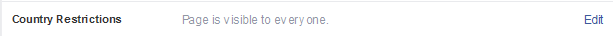

## How do I manually add a Listing by submitting the listing URL?

**Steps to Follow:**

1. Go to **Reputation Management > Listings > Primary Listings.**
2. Click on the Listing Source where you would like to add a listing.
3. Click on the dropdown to see more details, then click on **View Possible Matches**. Here you will see a dropdown menu where you can enter the listing URL. Click on Submit Listing URL, or alternatively, Create New Listing to navigate to that listing source and create a new listing.

## Why is my manually added listing not appearing yet?

Once you've added a URL, it can take up to 48 hours to process the new listing.

## Why am I getting an error when trying to add a listing URL?

An error may occur if we have suspended a source. You can check out our current [source disruptions](../../announcements/disruption-notices) to see if we are experiencing an issue with your specific source. If the source is not suspended, the issue could be with the type of URL you're trying to submit. For example, you will receive an error when you submit a search string instead of the actual listing page. Please see below for a list of common URL submission errors on specific sources.

**Facebook**

If the Facebook Page has a restriction (i.e. country or age restrictions), Facebook will not send it through their API. If you are a manager of the Facebook Page, please edit the privacy settings and remove the restriction. This will allow the page to be sent via their API and will resolve the issue.

You can test to see if the Facebook page you are trying to add is restricted by copying and pasting the Facebook page URL into an incognito browser window. If the page has a restriction, you will be prompted to log in to see the page. You may also see a page that indicates the page does not exist.

**To Remove Country Restrictions:**

- Once logged into Facebook, go to your Business Page to access the Admin Panel.
- Click on **Settings.**
- Click **General >** click **Country Restrictions.**
- Ensure that your Country's Restrictions are visible to everyone.

**LinkedIn**

Please make sure that the URL you are trying to add is for a Company page and not a Profile page. The LinkedIn URL field is programmed only to access Company page URLs.

If you would like to add a personal LinkedIn account to the Reputation Management product, you can add it under both the **Competition** and **Social** tabs.

***How to tell the difference:***

A company page will have the format https://www.linkedin.com/company/... OR https://www.linkedin.com/company-beta/...

A personal page will have the format: https://www.linkedin.com/in/...

For more information on setting up a company page check out the 'Manage your Company Page' section in the LinkedIn Help Center: https://www.linkedin.com/help/linkedin/topics/6227/6228.