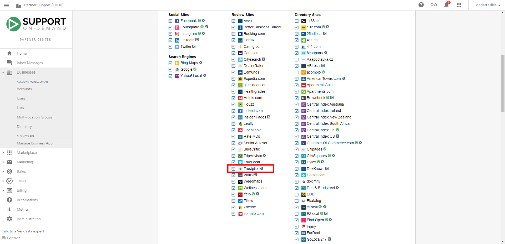

Trustpilot reviews are trusted by consumers and businesses alike as a trusted source for business and product reviews. In fact, 2.6 million reviews are posted on Trustpilot each month and over 6 billion are seen each month. Having a profile on Trustpilot can help establish credibility and improve a business's online reputation with current and potential customers.

Trustpilot also supports product reviews to help increase the trust in products sold through an online store. As eCommerce continues to grow in popularity and necessity, here at Vendasta we recognize the opportunity to support product reviews in Reputation Management in the future.

Trustpilot is turned on by default for all accounts. If you wish to turn it off, go to **Partner Center > Administration > Customize > Listing Sources**, uncheck the box beside Trustpilot and click **Save**.

In Reputation Management, go to **Listings** > **Primary Listings** to ensure the business profile is found. If the listing is "not found", click the downward arrow on the right, and then click **View Possible Matches.** If there are no potential matches, enter the URL of the business profile on Trustpilot.com and click **Submit Listings URL** or click **Create a new Trustpilot Listing** to create a business profile.

Once the business profile listing is confirmed, existing and new reviews can be monitored on **Reputation Management Pro** > **Reviews** > **Manage Reviews.** To respond to Trustpilot reviews, click **Respond** under a review to be taken to Trustpilot.com to respond on the site.