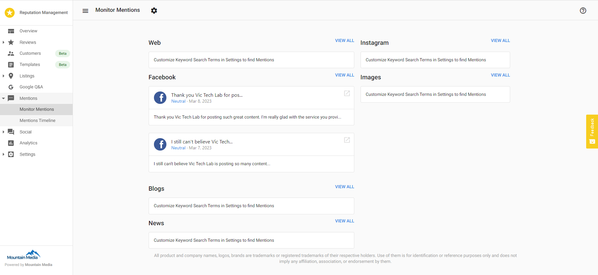
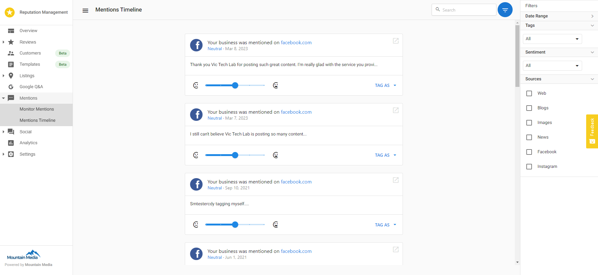
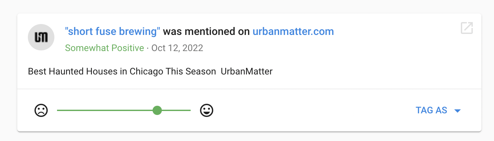

<iframe 
  src="https://www.youtube-nocookie.com/embed/xnuRCeXlmwQ" 
  width="560" 
  height="315" 
  frameborder="0" 
  allowfullscreen
></iframe>

### **What are Mentions?**

Beyond reviews, know what your customers are saying and where your business is being mentioned online. Track mentions from sources such as blogs, news media, and social media, excluding review sites. A mention can be any piece of content that we retrieve that matches your search criteria, including a blog post, X post, forum post, comment, photo, or news article. We use automated sentiment analysis to determine whether a mention is positive or negative.

With mentions, you can listen to and better understand your customers. Gain valuable insights, evaluate satisfaction, and improve customer support. Track trends, leverage insights into marketing opportunities to increase sales, and convert competitors' customers.

The **Monitor Mentions** sub-tab allows your customers to:

- See the overview of the most recent mentions for your business across all sources, such as blogs, social media sites, news sites, images, etc.
- Use the link **View All** if you would like to see more from one particular source

The **Mentions Timeline** sub-tab allows your customers to:

- Browse all the mentions a business location has received
- See the sentiment of each of those mentions, and make adjustments in case it has been incorrectly identified
- Tag a mention as **Starred**, **My Content**, or **Not Relevant**
- Filter searches by individual search terms, mentions sources, or sentiment

### **What are the different tagging options?**

**Starred**

Starring a mention is another way to save a mention that you found (i.e. one that you want to respond to, one to save as an example, etc.). You can view them later by selecting **Starred** from the **Filters** pop-out menu.

**My Content**

Tagging a mention as **My Content** makes it disappear from the results of the search. This is for scenarios where mentions from your own website, blog, etc. are displayed. It will be saved in the application for as long as you have an account and you can still view them by selecting **My Content** from the **Filters** pop-out menu.

**Not Relevant**

Tagging a mention as **Not Relevant** makes it disappear from the results of the search. If you're seeing a lot of mentions that aren't relevant, consider editing your searches to be more precise. Removing a result removes a post from your search results forever. It does not remove it from your account forever - you can still view it by selecting **Not Relevant** from the **Filters** pop-out menu.

### FAQs

**How do I edit the keywords to search for specific mentions?**

1. In **Reputation Management > Settings > Mentions.**
2. Add or edit **Keywords** here as required.

**Suggestions for the type of keywords to monitor:**

- Your brand, product, or service name
- Competitor name, product, or feature
- Industry-specific keywords
- Product launch name
- Product functions (ex - Voice recognition)
- Campaign names and keywords

**Tip:**

- Be sure to enter all variations of the company name as separate search terms.
- A phrase within the search box that is encapsulated by quotes will be read as an **exact match** phrase. E.g. "Coke or Pepsi" will find only that phrase, not the individual words.

**What is the purpose of Sentiment Rating in Mentions?**

The sentiment reflects the opinion of an author about a given topic. Negative sentiment, for example, would be a spiteful statement made against your brand, whereas positive sentiment would be an expression of praise or satisfaction with your brand.

Most of the mentions we see are neutral, meaning either the keyword or phrase you specified is mentioned in passing, without an opinion expressed, or there is not enough evidence of sentiment for us to make a good judgment of positive or negative opinion.

The **Sentiment Rating** can help the business organize and prioritize positive and negative reviews. Occasionally our sentiment analysis engine may attribute the wrong sentiment to a mention for a host of possible reasons. For example, if someone says, "This burger is sick!" it could get flagged as a negative mention even though colloquially it means that the burger is great. To correct such errors, you can manually adjust the rating by moving the slider left or right.

**Why is the Mentions card on the Overview page blank?**

The Overview will only display mentions if they have been found in the past 7 days. If there are no mentions within the last 7 days, you will be prompted to customize your **Mention Keyword Search**. By adjusting your keywords you may start to pull in new mentions that were previously not found.

**How often are new Mentions pulled in?**

Once a search has been added to an account, we search for mentions as often as every 24-48 hours and at least once every 7 days.

**Why are old Mentions getting pulled in?**

This can be based on where the content that your business is mentioned in, is ranked in search results. If the content moves up in search engine ranking it becomes more important and our system may pull it in.

**Do you pull in past Mention results and if so how far back do you pull?**

We try to find as much content on a business when an account is created. From time to time, we find an old article that we could not initially identify. In these cases, you may receive an alert about the newly found content, even though it could be a very old article.

**Why am I seeing irrelevant Mentions?**

This can happen as content is updated on certain web pages. If you have a mention that is not related to your business, you can select the **Not Relevant** button to remove it from your mentions. If you seem to be getting a lot of irrelevant mentions, consider making your search terms more specific.

**Why am I seeing little to no Mention Results?**

When an account first establishes its mention searches, or when new ones are added, it will get an influx of new mention results. Only a prioritized amount of the most relevant mentions for those searches are returned and displayed.

As time moves on, we search for mentions every 24-48 hours, but for new mentions to appear, they will have to make their way into that amount recognized as most relevant in search engine results. This is why, depending on an account's searches, it may only have 1 or 2 new mentions in a one-week reporting period. It is also possible that it would receive none at this time.

Note that the recent mentions box in the overview tab of Reputation Management only shows mentions from the previous week, and thus may sometimes be empty.

The number of mention results that are surfaced will be proportional to the quantity and quality of the mention searches set up and based on the actual number of mentions that are appearing online and matching those searches.

Enter several diverse mention searches to improve the number of mentions that come in.

**Why don't I see an article I was expecting to see?**

There are two potential answers:

1. Your search may be configured in a way that is preventing it from being retrieved, please double-check the search criteria (do you have too many required terms? Do the required terms exist in the article in question?).
2. The source may not have a lot of authority, meaning, there may be very few references to the source on the web and that will make it harder for us to find the content. In general, the more popular the source is that your business is mentioned, the easier it is for us to find the content.