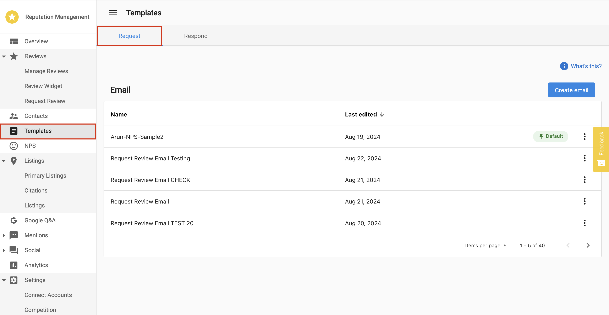
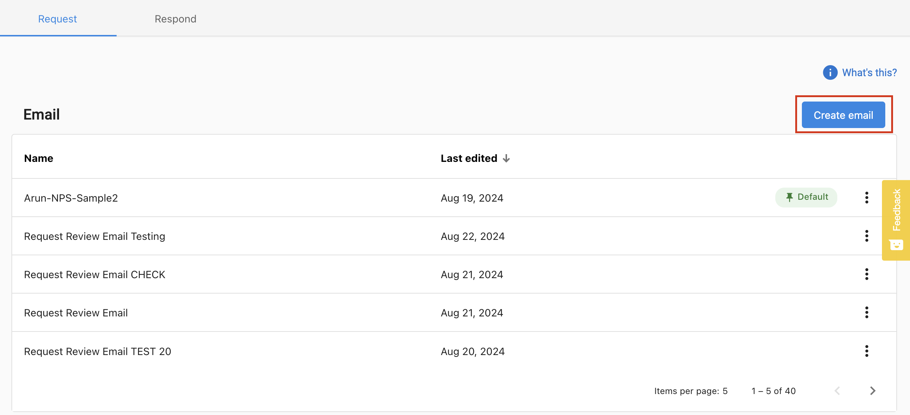
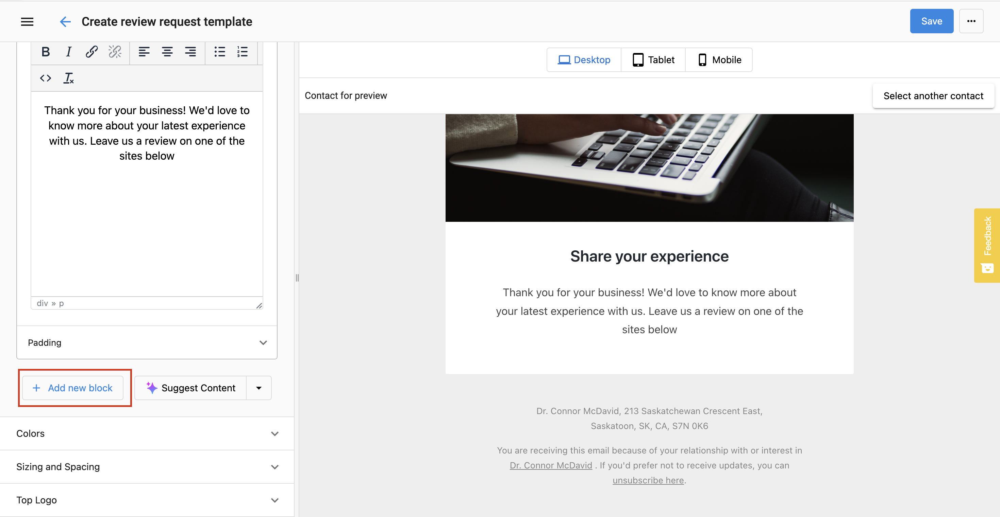
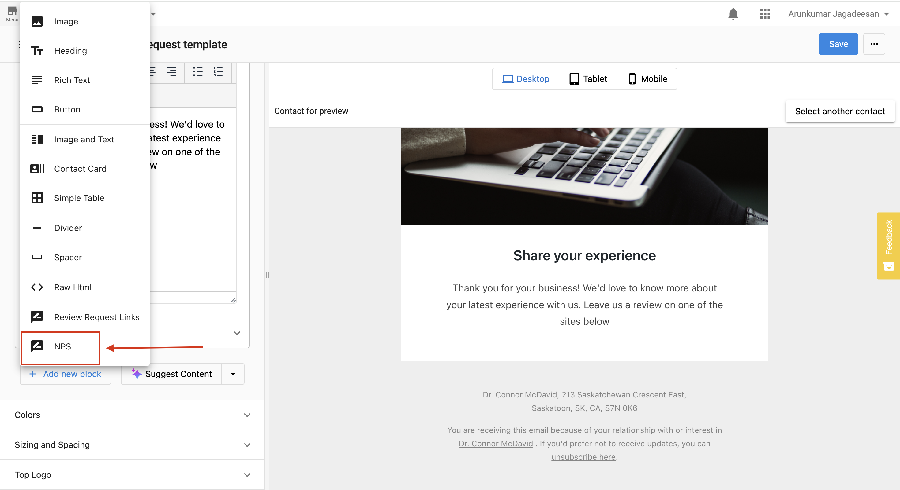
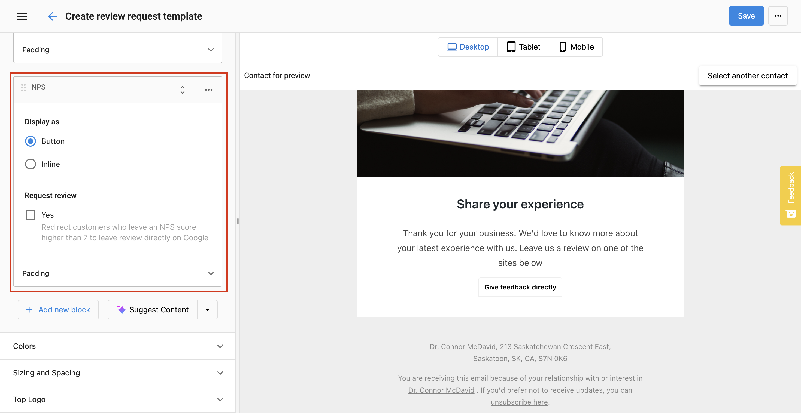
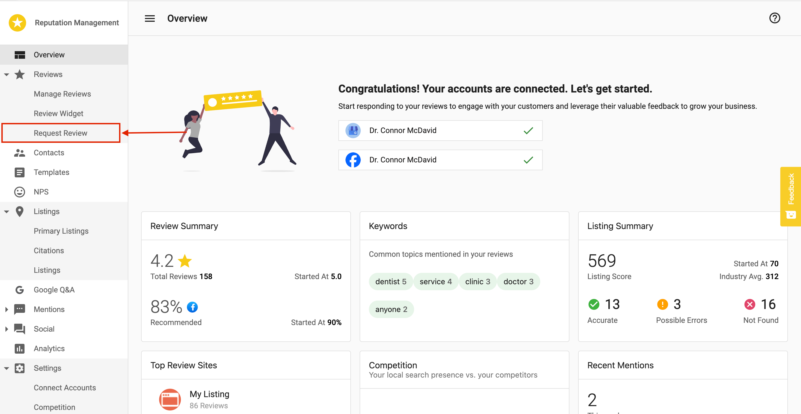
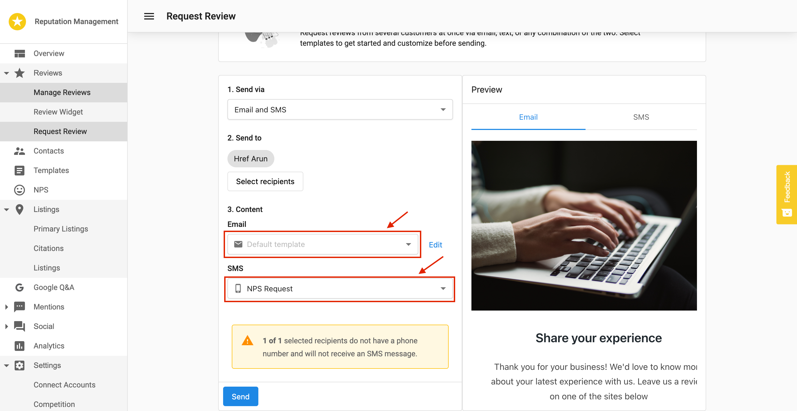
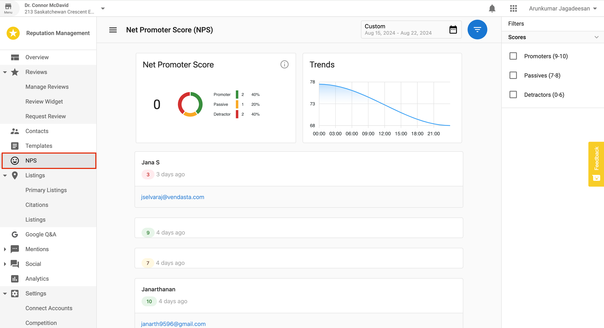
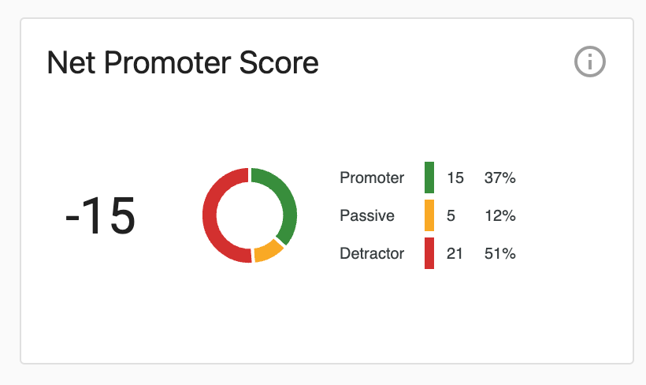
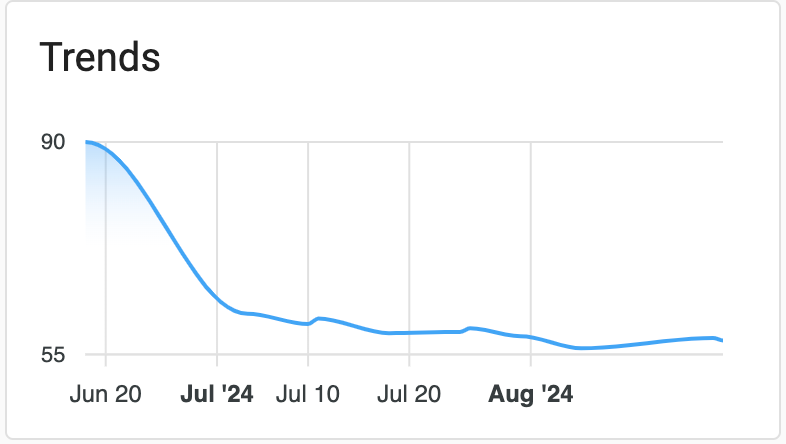

<iframe 
  src="//www.youtube-nocookie.com/embed/ytvUUojgX8M" 
  width="560" 
  height="315" 
  frameborder="0" 
  allowfullscreen=""
/>

To help your clients proactively manage their online reputation, Reputation Management Premium offers a Net Promoter Score (NPS) survey feature. Instead of sending review requests directly to customers—potentially leading to negative public reviews on platforms like Google Business Profile and Facebook—businesses can use NPS surveys to first gauge customer satisfaction. This gives them the opportunity to address any issues and improve their services, ultimately increasing the chances of receiving positive feedback on review sites.

### How to Use NPS

**Step 1: Create an NPS template**

- Navigate to "Templates" in the side menu of Reputation Management Premium and select the "Request" tab.

- Click on the "Create Email" button to create an NPS-type email using the email builder.

- Click on **Add New Block** to insert an NPS block inside your email template.

In the NPS block, you will have two display options:

1. **Button Option:** Allows customers to provide feedback directly from the email.
2. **Inline Option:** Displays scores from 0 to 10 in the email body.

- Configure the option (Enable/Disable Check Box) for customers with scores higher than 7 to be redirected to Google for reviews.
- Once the configurations are completed, click "Save."

**Note:** For SMS, the following message is hardcoded but will be customizable with the upcoming SMS template management soon.  
"[Business Name]: We'd love to hear about your recent experience with us. Leave us a review here."

**Step 2: Send NPS Survey**

- Navigate to "Review Requests" to send NPS survey emails to your audience.

- Below the "Content" section, you'll find options for email and SMS. Here, you can choose the templates created in the email builder and the pre-existing SMS templates. Select the NPS templates you've created and send them to your audience.

- After selecting the email and SMS templates, you can configure your audience and send the request.

**Step 3: Review Scores and Direct Feedback in Reputation Management Premium (View the NPS score and feedback)**

- Select "NPS" in the side menu to view direct feedback and scores from NPS surveys.

**NPS (Net Promoter Score):** View the average score for the account within the selected date range, along with the percentage breakdown of promoter, passive, and detractor.

**NPS Calculation**

NPS = % Promoters - % Detractors

- Promoters are customers who would recommend your brand.
- Detractors are customers who wouldn't recommend your brand.

**Trends:** Track the timeline of NPS scores over the specified period in the graph.

- Users can view customer feedback, scores given by their customers, and corresponding contact information in the NPS page.
- User can Filter feedback by:
  - Promoters (9-10)
  - Passives (7-8)
  - Detractors (0-6)
