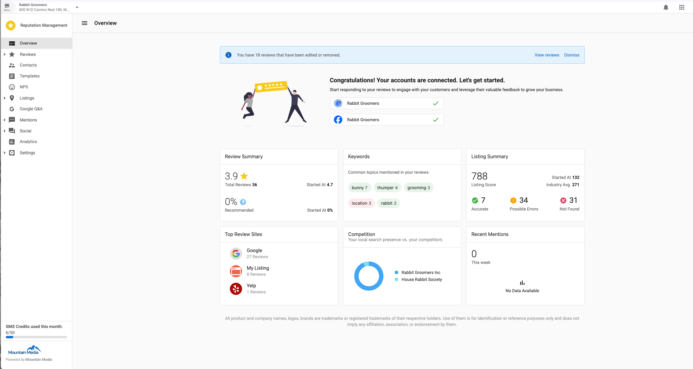

# Getting Started with Reputation Management

## What is Reputation Management?
Reputation Management is a centralized tool that helps businesses and teams monitor and manage their online presence. It brings together reviews, business listings, and online mentions into one platform, making it easier to take action and stay informed.

Users can track what’s being said across the web, respond to reviews, correct business information, and understand how their business compares to others in their industry. The platform supports flexible use—whether you want to manage everything yourself or collaborate with your team.

## Why is Reputation Management important?
Maintaining an accurate and active online presence is essential. But keeping up with multiple platforms, inconsistent business data, and scattered reviews can be overwhelming.

Reputation Management simplifies this by collecting everything in one place. This makes it easier to respond to customers, correct outdated information, track brand sentiment, and prove the value of your work—all without switching between multiple tools.

## What’s Included with Reputation Management?
Reputation Management includes tools for managing your business’s reputation across the internet:

- **Review Monitoring**: View reviews from major platforms in one dashboard
- **Listing Accuracy**: Identify and correct incorrect or missing business information
- **Mentions Tracking**: Monitor where your business is mentioned online
- **Sentiment Analysis**: Highlight key themes and tone in online reviews
- **Review Response**: Respond to reviews directly from the platform (when supported)
- **Automated Alerts**: Get notified of new reviews or important mentions
- **Reporting Tools**: Generate summaries and trend reports over time
- **Competitive Benchmarking**: See how your business compares to others in your industry

Feature availability may vary depending on your selected plan.

## How to Get Started
1. Log into Business App and navigate to the `Reputation Management` app.
2. Add or select a business location to monitor.
3. Connect review sources such as Google, Facebook, or Yelp.
4. Set up your business listings for tracking.
5. Configure alerts and reporting preferences.

Once setup is complete, the dashboard will begin populating data from connected sources.

## Managing Multiple Businesses
If you're managing multiple locations or client businesses, the platform allows you to:

- View and switch between businesses from one login
- Track reviews, listings, and online mentions for each account
- Generate separate reports for each business
- Organize teams by client, department, or region

## Reports, Alerts, and Automation
Stay informed and take action with built-in automation features:

- **Alerts**: Get notified by email when new reviews or mentions are detected
- **Scheduled Reports**: Receive recurring summaries of key metrics
- **Sentiment Highlights**: Understand common themes in customer feedback
- **Listing Updates**: Monitor changes to business data across key directories

## Feature Comparison by Plan

| Feature | Standard | Professional | Premium |
|--------|:--------:|:-------------:|:-------:|
| Manage reviews including responding to Google and Facebook | ✓ | ✓ | ✓ |
| Receive daily digest and executive reports | ✓ | ✓ | ✓ |
| Review display widget for your website | ✓ | ✓ | ✓ |
| Sentiment analysis of customer feedback | ✓ | ✓ | ✓ |
| Monitor listings on Google and Facebook | ✓ | ✓ | ✓ |
| Create and manage review response templates |  | ✓ | ✓ |
| AI-powered responses to reviews |  | ✓ | ✓ |
| Manage reviews on 100+ sources |  | ✓ | ✓ |
| Create unlimited customer review response templates |  |  | ✓ |
| Monitor online citations |  |  | ✓ |
| Monitor up to 3 competitors |  |  | ✓ |
| Monitor online mentions and social media presence |  |  | ✓ |
| Track review edits |  |  | ✓ |
| Add unlimited customers to your CRM |  |  | ✓ |
| Send unlimited email review requests monthly |  |  | ✓ |
| Bulk send review requests |  |  | ✓ |
| Request reviews and monitor 100+ sites |  |  | ✓ |
| Customize and save email review templates (coming soon) |  |  | ✓ |
| Customize and save SMS review templates |  |  | ✓ |
| Send SMS review requests |  |  | ✓ |
| AI-generated email templates |  |  | ✓ |
| Add your business logo to email templates |  |  | ✓ |

## Frequently Asked Questions (FAQs)

**What types of reviews are monitored?**  
Reputation Management pulls reviews from platforms like Google, Facebook, Yelp, TripAdvisor, and more.

**Can I fix incorrect business information?**  
Yes, the platform shows you where business listings are incorrect or missing so you can update them.

**Can I respond to reviews from within the platform?**  
Yes—if the review source allows it and is connected, you can respond directly.

**What is sentiment analysis?**  
Sentiment analysis automatically evaluates the tone of reviews to identify overall trends.

**How do I track mentions of my business online?**  
Mentions from blogs, news sites, and public social posts are automatically tracked.

**Can I compare my business to competitors?**  
Yes. Competitive benchmarking shows how your ratings and visibility compare to others in your industry.

**How do alerts work?**  
You’ll receive an email alert when a new review, listing change, or significant mention is found.

**Can I set up reports to be sent automatically?**  
Yes. Reports can be scheduled to send weekly or monthly to your email.

**Do I need technical skills to use this?**  
No. The interface is designed to be accessible for all users, with no technical setup required.

**What is the Premium edition of Reputation Management?**

The Premium edition of Reputation Management offers all the features of the Pro edition, plus advanced features including:

- AI-powered review responding
- Review response templates with AI-powered template suggestions
- Review monitoring and responding on the go with our mobile app
- AI-powered social content creation  
- Social calendar view
- Hashtag suggestions
- Email builder

**How do I upgrade to the Premium edition?**

If you are currently on the **Standard** edition, you will first need to upgrade to Pro, and then to Premium.

If you are currently on the **Pro** edition, you can upgrade directly to Premium.

**What is the Email Builder?**

The Email Builder is a feature exclusive to Premium edition that allows you to easily create and send professional email campaigns to your customers.

**How does the AI-powered review responding work?**

With Premium edition, you can use AI to automatically generate personalized responses to customer reviews. The AI takes into account the content of the review, your business information, and best practices for review management to create appropriate responses that you can edit before posting.
