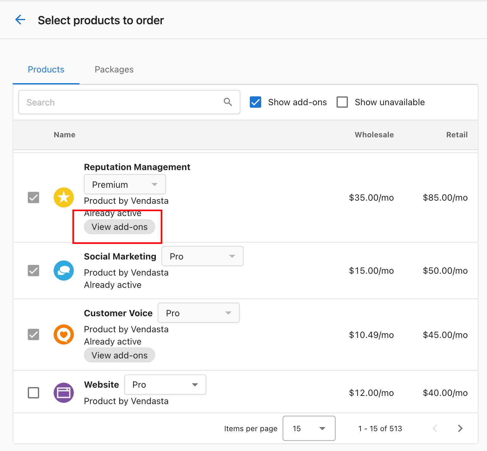

# SMS Add-ons in Reputation Management Premium

**Reputation Management Premium** offers 50 SMS credits for businesses in the United States and Canada. Now, users can add more SMS credits in the denomination of 50, 100, 200, 500, and 1000 SMS in the **United States, and Canada** in addition to 50 SMS credits for **Spain and Ireland.** With this addition, you can enhance your customer feedback and engagement efforts.

## Key Features

- **Location-Specific Review Requests -** Send review requests to customers in the United States, Canada, and the United Kingdom.
- **Flexible Denominations -** Choose from a range of SMS packages to suit your volume requirements:
  - SMS 50: United States, Canada, Spain, Ireland
  - SMS 100: United States, Canada
  - SMS 200: United States, Canada
  - SMS 500: United States, Canada
  - SMS 1000: United States, Canada
- **Enhanced Customer Engagement -** Leverage SMS as a powerful tool to engage with your customers and collect valuable reviews.

## How to Use SMS Add-Ons

**Purchase SMS Credits -** Navigate to the desired account > Select 'Order Products' > and then click "View Add-Ons" under Reputation Management Premium to select and purchase the desired SMS package.

## Why Should I Use SMS Add-Ons?

- **Improved Customer Feedback -** Gain valuable insights and feedback from customers in different regions.
- **Higher Engagement -** Reach out to customers through SMS, a channel known for high open and response rates.
- **Global Reach -** Expand your customer feedback initiatives across international markets.