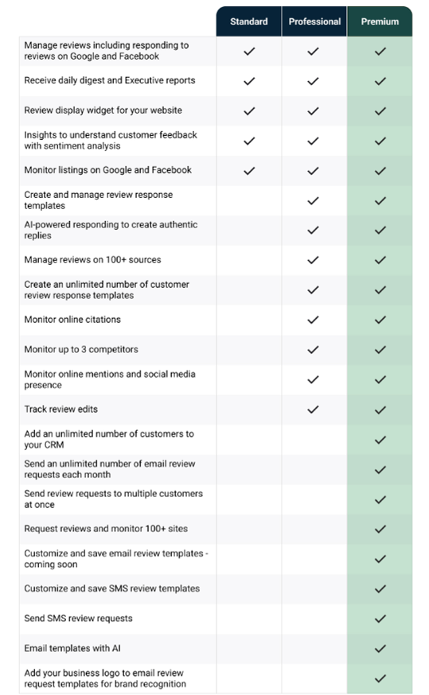

<iframe src="//www.youtube-nocookie.com/embed/-Pu6nmKOsK0" width="560" height="315" frameBorder="0" allowFullScreen="true"></iframe>

At its core, Reputation Management is a product that allows you and your clients to monitor their online listings for accuracy, as well as keep on top of new reviews.

Reputation Management gives your agency the ability to easily manage and monitor your clients' online reputation—all from one place! It gives you the flexibility to manage their online reputation together, do it all for them, or let them do it all themselves. With Reputation Management, monitor what people are saying about them online and improve their visibility in local searches. Show your clients how they stack up against the competition, stay in the know with automated alerts, and utilize progress reports to prove your agency's worth. Plus, because it's white-labeled, you can resell it under your own brand and provide your clients with one place to manage and monitor their online reputation.

### How can Reputation Management help my agency?

Reputation Management helps your agency solve three primary pain points.

- **It's hard to stay on top of what people are saying about all your clients.** There are countless review sources, social sites, and ways for people to talk about your clients online. It is impossible to keep up with *one*—never mind *all*.
- **It's hard to show an ROI for managing your client's reputation.** Proving the value in the work you do for each of your clients' online reputations is difficult to do.
- **Need a way to coordinate and collaborate -** It's hard to coordinate the reputation management of several clients, provide transparency of what reviews have been responded to, and work with multiple teams/clients in one collaborative tool.

In addition to the above, Reputation Management can streamline and aid your agency in the additional ways:

- **Automatically monitor and report.** Keep on top of online activity affecting the reputation of a business, including reviews, listings, and social media, helping you make expert recommendations, and provide proof of performance.
- **Sell it as your own.** Your logo, your name, your colors, your price. Reputation Management is 100% white-labeled, giving you a profitable way to provide reputation management services under your own brand.
- **Collaborate on any level.** Reputation Management adapts to the level of involvement required from each of your clients. Manage their reputation together, do it all for them, or let them do it all themselves.
- **Serve multiple clients from one place.** Managing the reputation of multiple clients requires coordination and efficiency. With Concierge, your team will be able to manage all of your clients' reputations effortlessly.

### How can Reputation Management help my clients?

We put all of the tools your agency can use to monitor your clients' reputations directly in their hands. Through Reputation Management, key pain points are addressed:

- **Being unaware of customers makes your clients look bad.** Having unanswered online reviews and social posts, or negative mentions is bad for business and highlights your clients' negative reputation for everyone else to see.
- **Incorrect business info is hurting their business.** Wrong business information is driving potential customers right to the competition.
- **It's hard for clients to stay on top of what people are saying about their business.** There are countless review sources, social sites, and ways for people to talk about your clients' businesses online. It is impossible for them to keep up on their own—never mind the competition.

Reputation Management directly resolves these issues:

- **Allow your clients to manage their online reputation from one place:** Compile reviews from dozens of sites so they can easily see what's being said about their business online. Plus, use competitive benchmarking to see how they stack up against the competition.
- **Show up where people are looking:** Improve their business' search rank by identifying online business listings that are inaccurate or missing from essential directories like Google, Facebook, and Bing.
- **See what customers are saying all over the web:** Monitor when their business is mentioned in a variety of sources, including news sites, blogs, and social networks. Plus, highlight the most positive and negative mentions using automated sentiment analysis.
- **Stay informed with automated reports and alerts: Executive reports break down how their business is faring in online conversations and help them understand what to do. Alerts are also sent every time new information is found.**

### What are the major features of Reputation Management Standard, Pro, and Premium?

