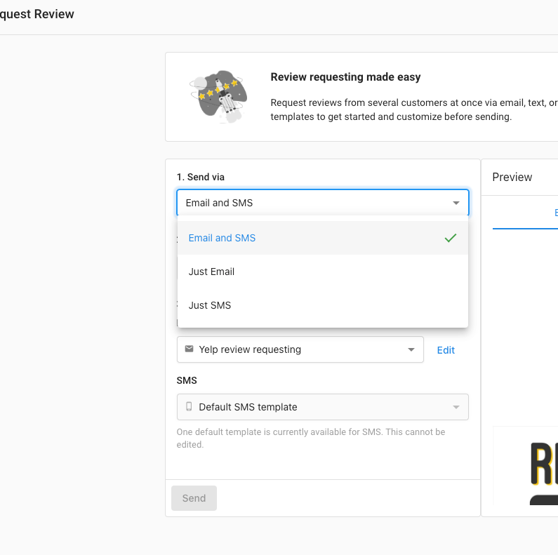

## What are AI-Generated Review Responses?

Artificial intelligence has been integrated into the **Manage Reviews** functionality in Reputation Management to allow users to quickly create a review response using AI-generated content. This feature works for accounts with Reputation Management Pro. The AI-suggested response feature can be used in the app to respond directly to Google or Facebook reviews and used to generate responses for other review sites. See below. 

## Why are AI-Generated Review Responses important? 

Streamlines the process when a Partner or a user wants to quickly respond to a review on Google or Facebook to save time, improve the ease of content creation, reduce research needed, and allow users to interact with their audiences faster. 

## How do AI-Generated Review Responses work?

Go to the Reputation Management dashboard then click **Reviews > Manage Reviews** in the main menu. Filter reviews by **Without Responses** to display the reviews that require a response. Look for **Suggest Response** and select that:

After clicking **Suggest Response** the AI will generate a response. If you have templates set up in different languages, the AI can even understand the language that the review was left in, and will respond in the detected language!

**Note:**

The AI response Suggest Response only appears if there are response templates corresponding to the rating/star number given in the reviews.  

 To ensure the [AI response templates](../templates/templates-overview) appear, users need to have response templates that cover all star ratings, including the missing 1-star or 2-star cases. 

After the AI response is generated, the user can make edits or changes to it. If the user is satisfied with the response, simply click the **Respond** button. 

The AI-suggested response feature can also be used to respond to reviews from other sites. Simply click the **Suggest Response** button to generate the response then click **Copy response > Respond on [review site]** where this AI-generated response can be used. 

