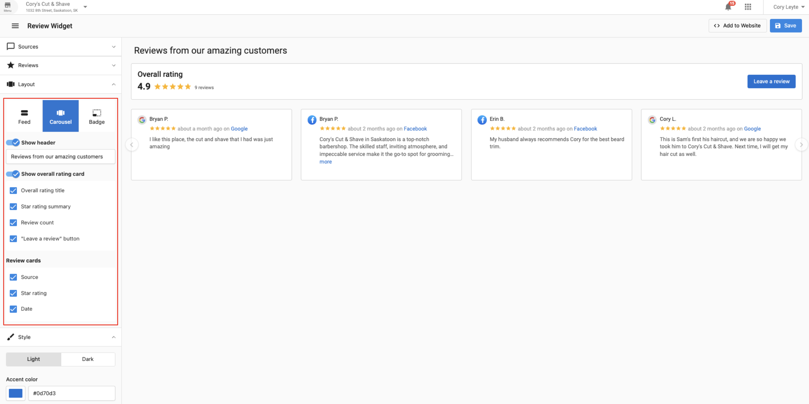
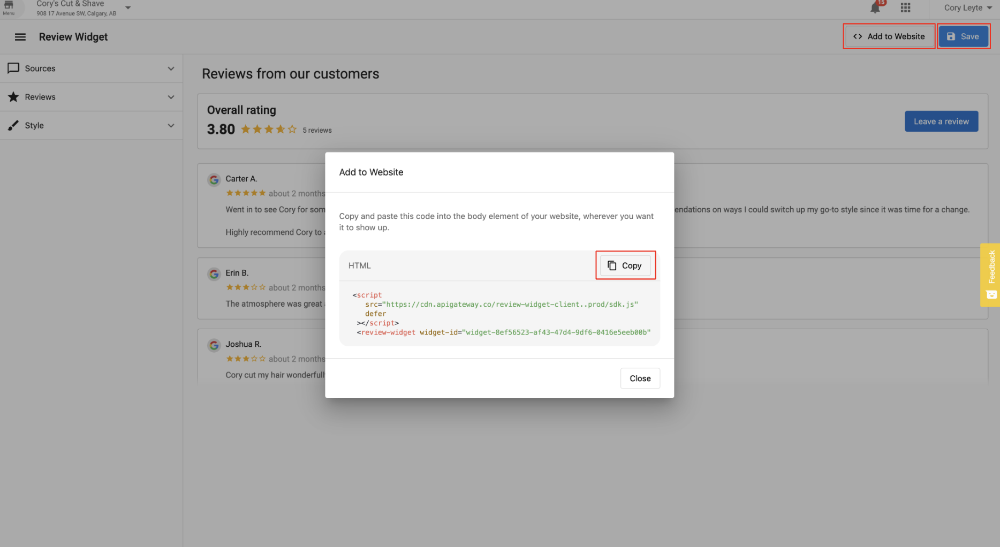
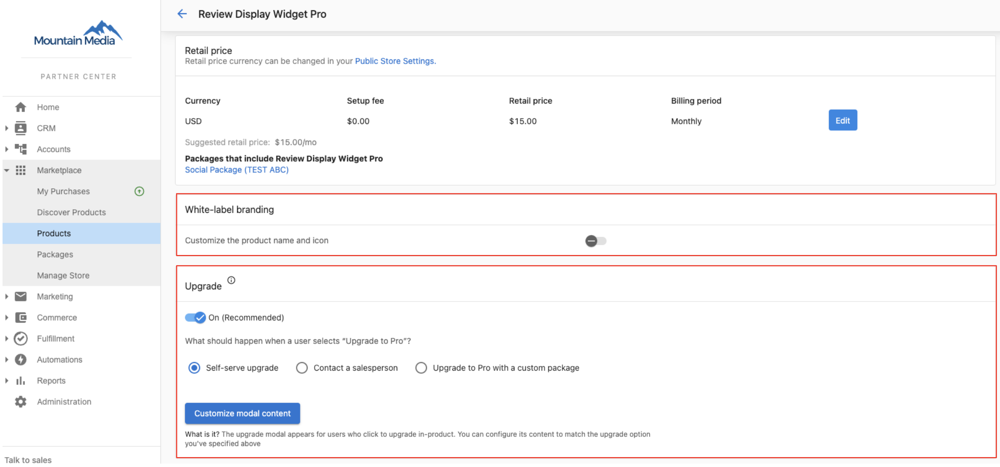

<iframe src="//www.youtube-nocookie.com/embed/kSMkNnYWx3Q" width="560" height="315" frameborder="0" allowfullscreen></iframe>

The Review Widget in Reputation Management allows users to request and display reviews from popular review sources like Google and Facebook, as well as My Listings if Local SEO is activated. Popular review sources, such as Google and Facebook, are now included in any edition of Reputation Management, with other review sources available with the purchase of Review Widge Pro, which is coming soon.

### What is included in the Reputation Management Review Widget?

| Functionality | With all editions of Reputation Management | With the purchase of Review Widget Pro |
| --- | :---: | :---: |
| Google, Facebook, and My Listings review sources | ✅ | ✅ |
| Additional review sources (coming soon) | ❌ | ✅ |
| Feed layout | ✅ | ✅ |
| Carousel layout | ❌ | ✅ |
| Badge layout | ❌ | ✅ |
| Layout customization | ❌ | ✅ |
| Light and dark themes | ✅ | ✅ |
| Accent colour | ✅ | ✅ |

### To customize the review widget, follow these steps:

**Step 1:** Go to "Business App" > "Reputation Management" > "Reviews" > "Review Widget."

**Step 2:** The Review Widget interface will appear.

**Step 3:** Select "Sources" for the review sources you would like to request reviews for and those you want displayed on your website. Users can request and display reviews from Google, Facebook, and My Listings if Local SEO is activated. Users can only select one source to request reviews from on the Review Widget, whereas all sources can be displayed.

**Step 4:** Select "Reviews" to configure the reviews displayed on the review widget by star rating and the rating format with one or two decimal points.

**Step 5:** The "feed layout" is the default layout for the Review Widget, for users who want to customize the layout, select "layout" and choose from either the carousel or badge with new configurations with the purchase of Review Widget Pro.

**Step 6:** Select "Style" to change the appearance of the Review Widget from light to dark or adjust the accent colour to match the website's styling.

**Step 7:** Once you have configured the Review Widget, select "Save" and "Add to Website" to copy and paste the HTML code into the website's body element. If you change the sources, layout or styling after the HTML code has been installed on the website, you only have to press save to push those updates to the live widget.

### How do enable/disable the upgrade path?

In the Marketplace, search for "Review Widget Pro." The upgrade paths are located under the "Product Info" tab. Review Widget Pro resellers can white-label the add-on with a new product name and logo and enable or disable the upgrade path. Note that the layout options will be greyed out to the user when the upgrade path is enabled. However, if the upgrade path is disabled, the user will be completely unaware of the upgraded functionality.

### How do I make changes to the existing widget?

For existing users who have the Review Widget installed on a website, don't worry, those reviews will continue to be displayed. However, in addition to the layout and styling options, you must install the new Review Widget's HTML code on the website to edit the sources.