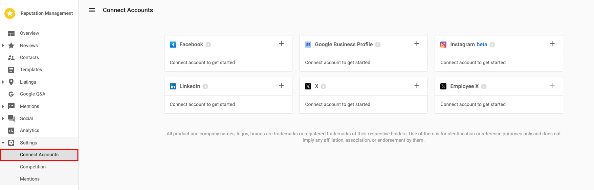

# Reviews: Getting Started

## How to see your reviews

Go to **Reputation Management > Settings > Connect Accounts**. Here you can connect and authenticate all accounts you would like to pull reviews in for, by clicking the plus + in the top right corner of each account card.

## When are new reviews pulled in?

Once a listing is found in the Listings tab through [Best Match](../listings/best-match) or manually accepted by a user (Marked as Mine), the process to start finding related reviews is triggered. After this initial trigger, we will search for new reviews **once every 24 hours**.

To see your reviews go to **Reputation Management > Reviews > Manage Reviews**. Scroll down to see all the reviews.

## Why am I not seeing any reviews?

There are three primary reasons we will not have pulled in reviews for an account:

1. The business doesn't have any reviews on the source(s) that you have active for this account.
2. We don't have enough information about the business to find reviews. If you do not see a Listing on the Listings page, then there will be no reviews brought in. Reviews are brought in based on an existing listing, to ensure that they are being brought in for the correct business. For more effective searches for existing Listings, ensure that your Business Profile information is accurate and we have all your details, including your phone number. 
3. There is currently a source disruption that's preventing new reviews from getting pulled in. Click here to view our current [Source Disruptions](/getting-started/announcements/disruption-notices).

## Why was a review pulled in late?

Many sites don't publish reviews as soon as they are posted. When they do post the review, they enter the published date as the date the user submitted it. There is no way for us to "find" the review the day it was submitted. When we pull the review into our system, the date may appear as being pulled in late, when in actuality it was published to the review site after it was submitted.

As an example, TripAdvisor states on its website:

*"It usually takes 24-48 hours for reviews to be visible on our site. It may take up to several days if your review requires a closer look by our editors. This may happen if you attach a large number of photos to your review, or bend or break our review guidelines."*