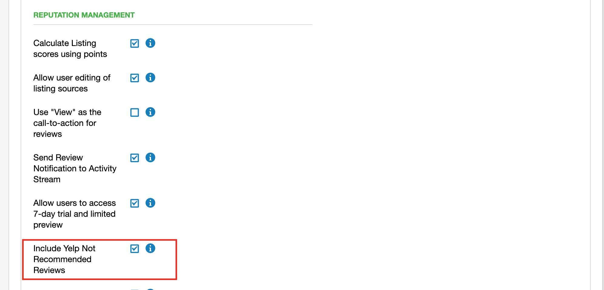

**'Not recommended' Yelp reviews** are reviews that were flagged by Yelp's automated software for not meeting the criteria of "being most helpful" to the Yelp community. To include these reviews in Reputation Management:

1) Navigate to **Partner Center > Administration.**

2) Click on **Customize > General Product Settings.**

3) Under the Reputation Management section, check the box for **"Include Yelp Not Recommended Reviews."**

