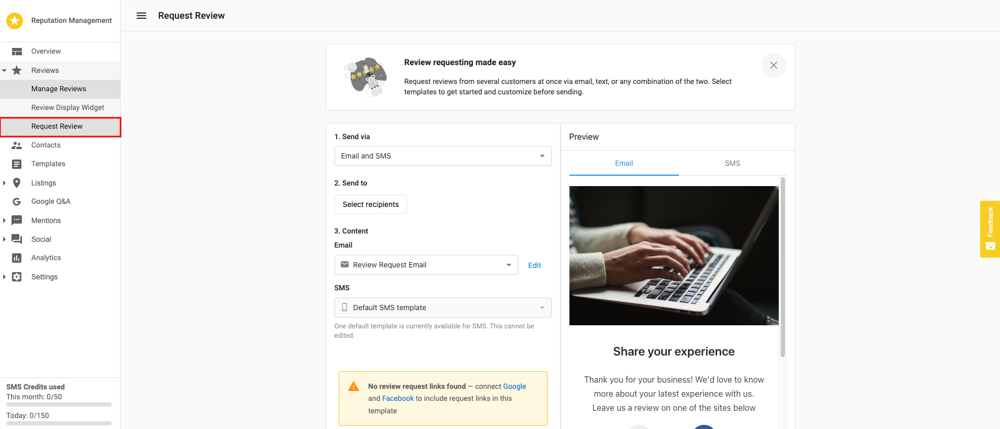
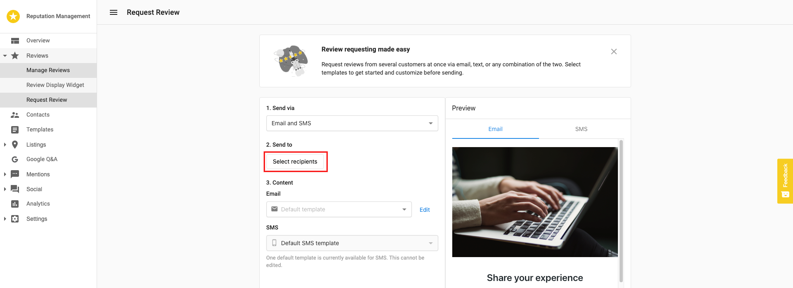
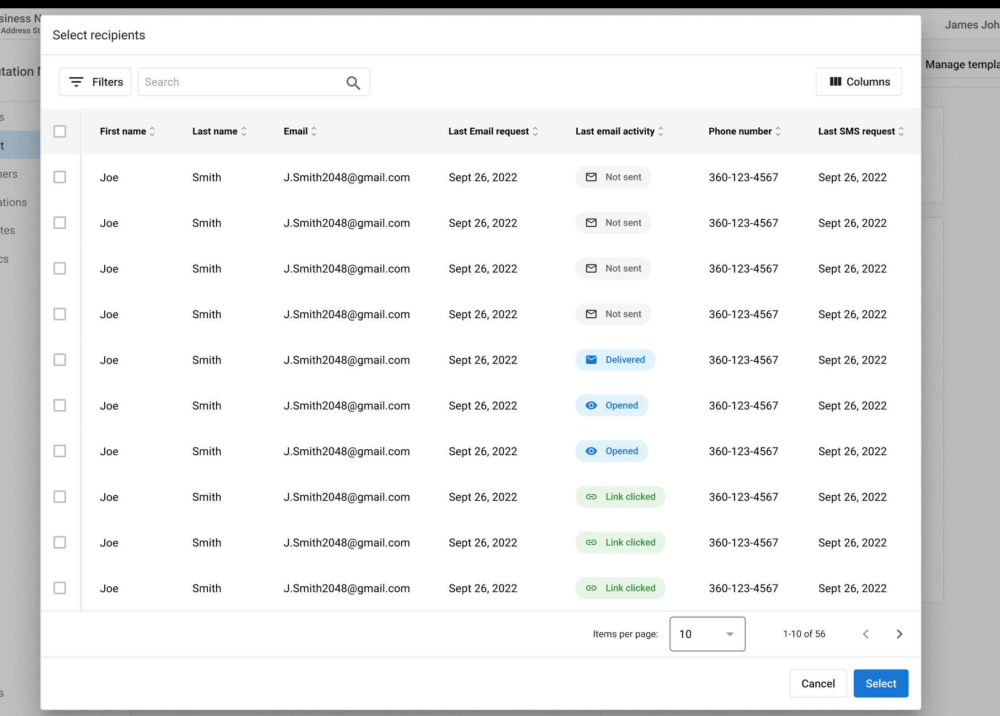
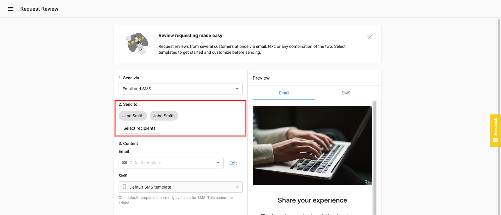
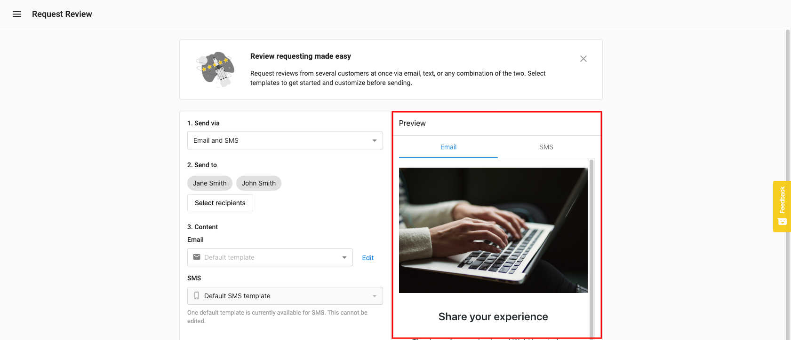
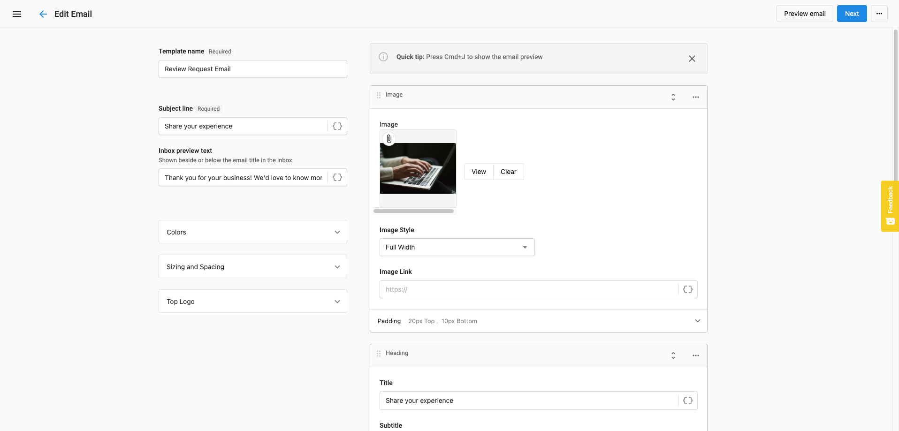

# Sending Review Requests

Reputation Management Premium allows you to send branded review requests to your customer's contacts. This capability is accessible through Review Requests Management within the platform.

To send a review request, follow these steps:

1. Click on the Review Requests Management tab and select "Send Review Requests" to initiate the process

2. Select the review site(s) where you want to direct customers to leave reviews

3. Add recipient(s) using one of the following methods:
   - The "Add Recipient" feature to add customers one at a time
   - The "Upload List" feature to bulk upload recipients from a CSV file

4. For individual entries, provide customer information by entering their name and email address

5. For multiple entries with the CSV upload, the file should include:
   - First Name
   - Last Name
   - Email Address

6. After adding recipients, select "Add Recipients" to proceed to the email template page

7. Customize the email template with the following options:
   - Email From - Set a specific email address as the sender
   - Subject Line - Modify the default subject line
   - Header Logo - Upload a custom image
   - Email Body - Edit the message content
   - Background Color - Change the background color of the email

8. Preview the email by clicking the "Preview" button

9. When satisfied with your review request, click "Send" to deliver it to your selected recipients

10. View the status of your review requests in the "Requests" section of Reputation Management Premium

## Important Notes

- One credit is consumed per email recipient
- Each review request batch can be sent to a maximum of 50 recipients
- To send to more than 50 recipients, you will need to create multiple request batches
- Review requests can be scheduled to be sent at a specific date and time
- You can duplicate past review requests to save time on future campaigns