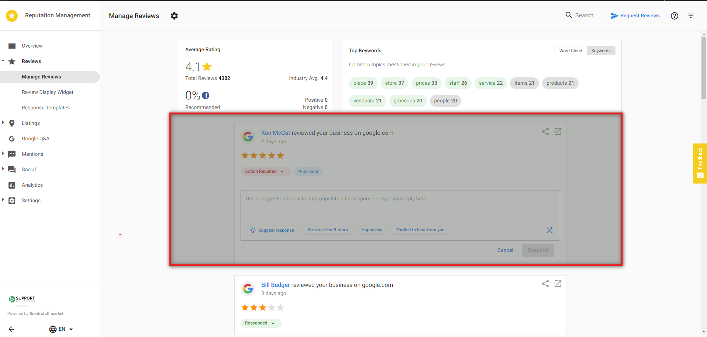
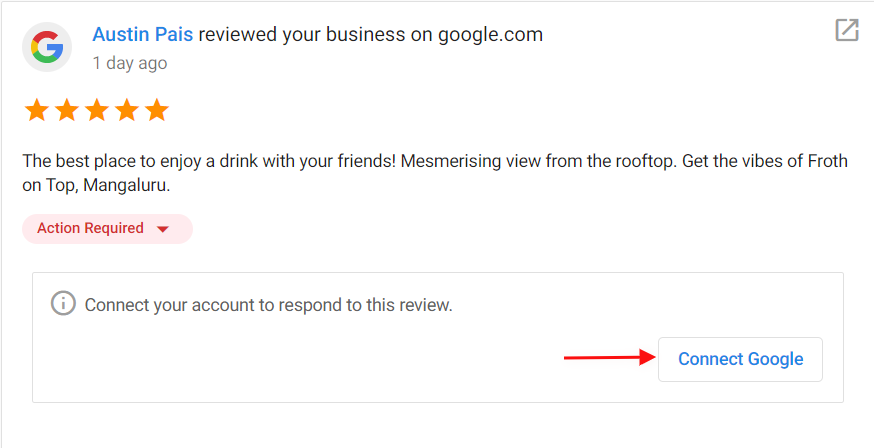

# Respond to reviews in Reputation Management

To respond to reviews in Reputation Management, navigate to **Reviews** > **Manage Reviews.**

You can respond directly to Google, Facebook, and My Listing reviews from this page. The Google and Facebook accounts must be connected in Reputation Management to respond. Connect these accounts by going to **Settings** > **Connect Accounts** > click on **+** to connect Account.

To respond to a Google, Facebook, or My Listing review, type your response in the text field. Alternatively, choose from one of the review response suggestions to automatically populate a response in the text field.
**Note:** All review response suggestions can be edited within the text field.

Click **Respond** to post your response automatically to the site.

If the account is not connected, you'll be directed to **Connect Account** before you can proceed to click **Respond**.

For all other review sites, such as Yelp or TripAdvisor, click **Respond** and you will be taken to the site where you can respond to the review.

## Responding to Positive Reviews

For positive reviews, thank them for their praise, and invite them to come back. You can let them know about upcoming promotions that they might be interested in. You can use your business name in the response to increase your SEO. Remember, positive reviews also make great social posts! If you have Social Marketing connected to the account, click the **Share** icon to share the review on your social networks.

## Responding to Negative Reviews

Negative reviews should also be personalized to the content of the review. You want them to know that you are listening to their concerns. Make sure to apologize for the experience, and invite the reviewer to resolve the issue offline. It's always better to deal with their issues privately.

## Unable to respond to Google Review

You may encounter an error message when attempting to respond to a Google review. This is usually caused by the review being removed from Google shortly after it is pulled into Reputation Management.

*Note: We attempted to include an image here, but the image could not be retrieved from the external source.*

## FAQs

Which sources pull into Reputation Management?

Google, Facebook, Yahoo! Local, Booking.com, Expedia.com, Zillow, Indeed.com, TripAdvisor, Apartments.com, Yelp, Glassdoor.com, Grubhub, Hotels.com, Cars.com, Cargurus, Apartment Guide, Better Business Bureau, OpenTable, Trustpilot, Avvo, Edmunds, Wellness.com, DealerRater, Houzz, Angi (Angies List), Healthgrades, Zocdoc, Vitals, Rade MDs, A Place For Mom, Caring.com, Senior Advisor, Weedmaps, Leafly, Insider Pages, Carafe, Citysearch, Foursquare, TrueLocal . . . and many more!

Can I respond to all review resources directly in the product?

You can respond to Facebook and Google reviews directly within our user-friendly interface, making it quick and straightforward. For other review sources, we've designed a convenient process. You can effortlessly draft your responses within the Reputation Management Product. Once you're satisfied with your message, a simple click takes you to the source platform, where you can easily copy and paste your prepped response.

How long does it take for Google and Facebook reviews to appear in Reputation Management?

Once Facebook and Google Business Profile accounts are connected, reviews (including historical reviews) from these sources will pull in almost immediately. After this, Reputation Management scrapes for reviews once per 24-hour period. If the add-on Rapid Reviews is activated, Reputation Management will scrape for reviews twice in a 24-hour period.

