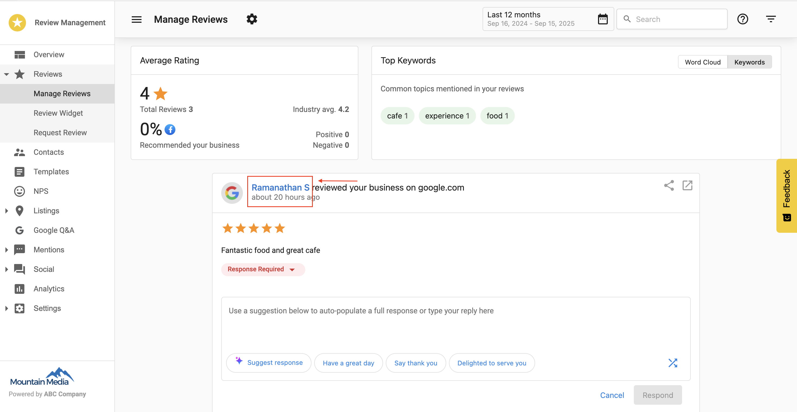
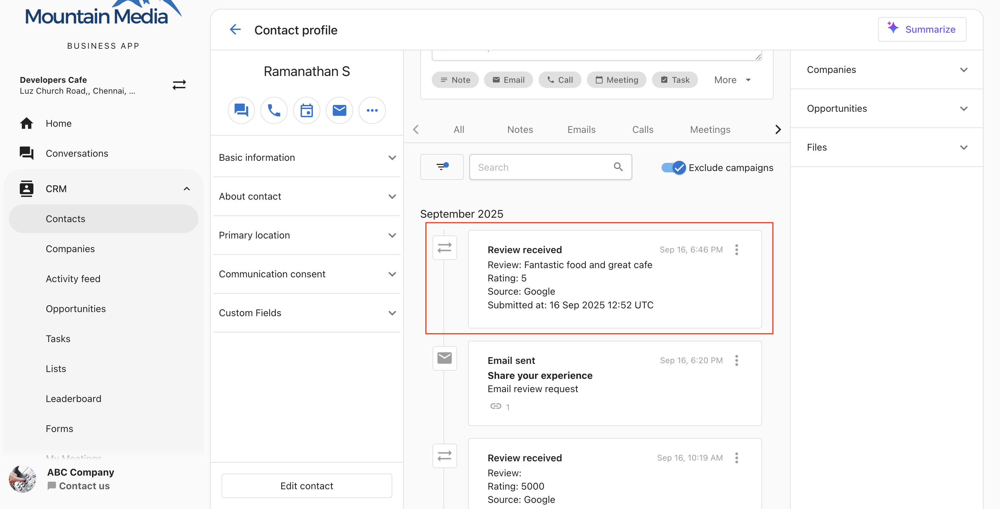
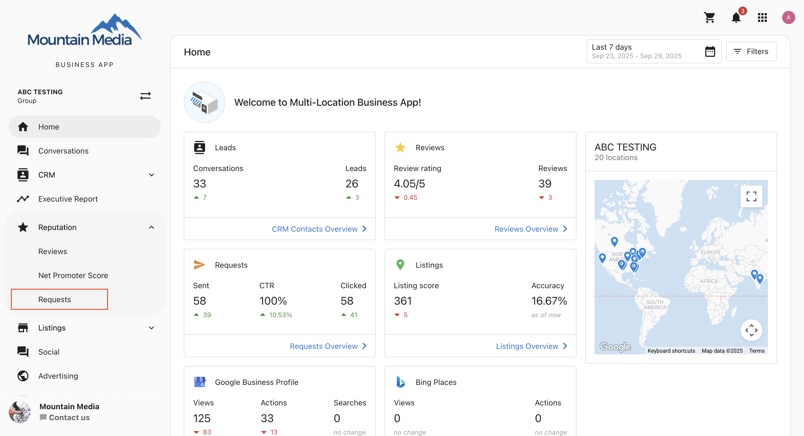
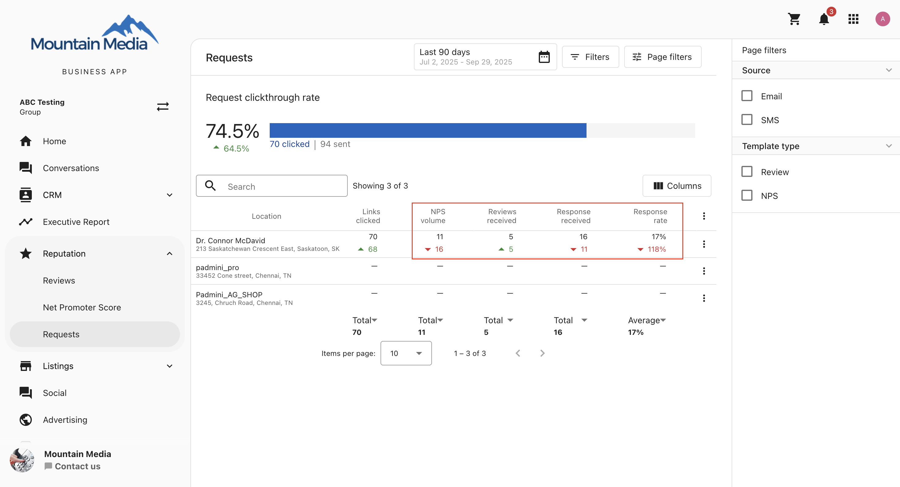
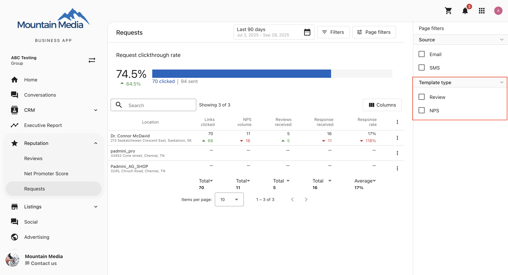

## What is review matching?

Review Matching helps you determine whether a review came from a known contact in your customer list. It automatically compares new reviews to existing contact details such as name, email, or phone number.

This feature gives you greater context about each review and helps you track the effectiveness of your review request campaigns.

## Why is review matching important?

- **Know your reviewers**: Identify whether a reviewer is already in your contact list.
- **Measure request effectiveness**: Track how many reviews result from your requests.
- **Smarter follow-up**: Personalize responses based on full customer context.

## What’s included with review matching?

- Matching status indicators in the Reviews section
- Review details in the Contact Timeline
- Request activity insights at the multi-location level
- Filters and metrics to analyze review and NPS performance

## How to use review matching

### Step 1: Navigate to reviews

Go to `Reputation Management` and select `Manage reviews`.

### Step 2: Understand review cards

In the Manage Reviews page, each review card shows the match status:

- **Linkable Name** → Review is matched to a contact.
- **Non-Linkable Name** → Review is not matched.

### Step 3: Review contact timeline

In a matched contact’s timeline, the Review Card includes:

- **Review**: Full review content  
- **Rating**: Star rating (1–5)  
- **Source**: Platform where the review was left  
- **Submitted at**: Date and time of the review

 

### Step 4: Navigate to multi-location requests

In the side menu, select `Reputation`, then go to the `Requests` tab. This view shows review request activity across locations. Review Matching is also applied here.

### Step 5: Analyze requests section

Key columns in this section:

- **NPS Volume**: Number of NPS responses received  
- **Reviews Received**: Number of reviews collected  
- **Responses Received**: Combined total of reviews and NPS feedback  
- **Conversion Rate**: Percentage of responses vs. total requests sent

### Step 6: Use NPS & review filters

Use the filters at the top of the Requests section:

- **NPS**: Displays only NPS-related data  
- **Reviews**: Displays only review-related data

## Frequently asked questions (FAQs)

From when does Review Matching apply?

Review Matching applies only to new reviews received on or after September 30, 2025. Historical reviews will not be matched.

Why are some reviews not matched with contacts?

If the reviewer’s name, email, or phone does not match any contact, the review will remain unmatched.

What happens if a review is matched with the wrong contact?

Contact support to detach the review from the incorrect contact. Self-service options will be available soon.

How do I know if a review is matched to a contact?

In the Manage Reviews page:

- **Matched**: Name appears as a clickable link.  
- **Unmatched**: Name appears as plain text.

How is the conversion rate calculated?

Conversion Rate = (Total responses received ÷ Total requests sent) × 100.  
Responses include both NPS feedback and reviews.

What if a contact leaves both NPS feedback and a review?

The contact appears in both filters but is counted as one unique response for conversion calculations.

What do the columns in the Requests section mean?

- **NPS Volume**: Number of NPS feedback responses received  
- **Reviews Received**: Number of reviews collected  
- **Responses Received**: Combined total of NPS + reviews  
- **Conversion Rate**: Percentage of responses vs. requests sent

Can I filter results to see only NPS feedback or reviews?

Yes. Use the filters in the Requests section:

- **NPS**: Displays only NPS-related data  
- **Reviews**: Displays only review-related data

