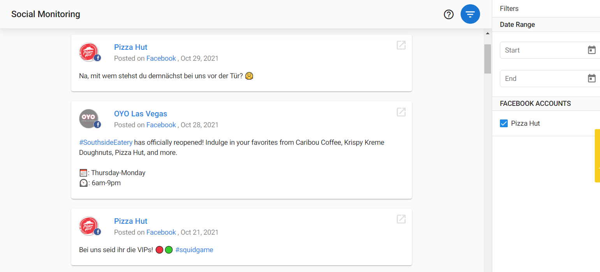

<iframe src="//www.youtube-nocookie.com/embed/v6tHhvJiej0" width="560" height="315" frameborder="0" allowfullscreen=""></iframe>

Social is not only about creating great posts. It's also a valuable tool to observe and analyze what content and channels are driving the most traffic.

When people comment on your Facebook posts or share your posts on X, you'll see it here. Users can connect multiple social accounts to monitor activity, track growth over time, and compare their profiles against industry averages.

**How monitoring your Social can benefit your business:**

- Engage with your customers faster
- Generate new leads
- Identify influencers and advocates of your brand
- Get valuable positive and constructive feedback
- Listen to your customers, respond, and repeat, to keep the conversation going.
- You can check your social profiles and stats regularly to learn what your customers want and how you can reach them more effectively.

**How monitoring your Employees' Social can benefit your business:**

- Keep track of your employees' most recent activity across all their X accounts from a single platform.
- Online information can travel fast, and it's important to know your employee's posts and shares.
- Monitoring activity helps keep everyone within the company on the same page and share the same values.

In the **Social** tab of the Reputation Management product:

- Use **Social Monitoring** to monitor a business' social feeds over a while. Keep track of Facebook page likes and X followers, and check recent activity.
  
- Use **Employee Monitoring** to monitor an employee's X feed over a while. Keep track of recent activity and be aware of any content that may affect the business
- View **Social Analytics** under Reputation Management > Analytics > Social tab to review your stats on connected social profiles and compare your presence against industry averages

To get started using **Social,** connect your social profiles or pages you want to monitor:

- Go to **Reputation Management > Settings > Connect Accounts**
- Click the + in the top right corner of the account you want to connect 
- This will redirect you to that source, where you can authenticate your account

**Expired Social Account Notifications**

When a social profile's connection has expired, this notification is visible near the top of the page. It allows the user to either re-authorize their social profile or remove it.

An expired social token means the user's social profile has severed the connection between the social platform and Vendasta's platform. It varies by social platform, but most implement an automatic token expiry every 90 days for security purposes. 

For our platform to work correctly, we need the **social profile re-authorized**. If the token is not reauthorized, the customer will not see recent activity in their social feed.