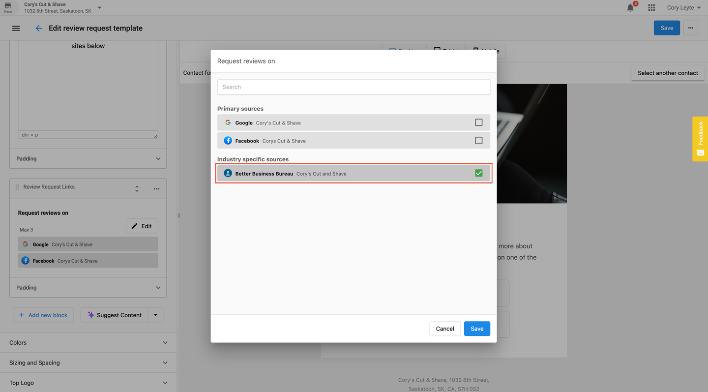

Use the email builder in Reputation Management Premium to request reviews on industry-specific review platforms.

To get started with requesting reviews to industry-specific platforms:

## Step 1: Navigate to "Templates"

Go to the "Templates" section within Reputation Management Premium and either create a new email template or edit an existing one.

## Step 2: Access "Review Request Links"

Find the "Review Request Links" option in the email template builder. Here, you can select the industry-specific review platforms you want to include. Only the platforms where our system has detected reviews will be available for selection.

## Step 3: Save Your Template

After selecting the desired platforms, click "Save" to apply your changes.