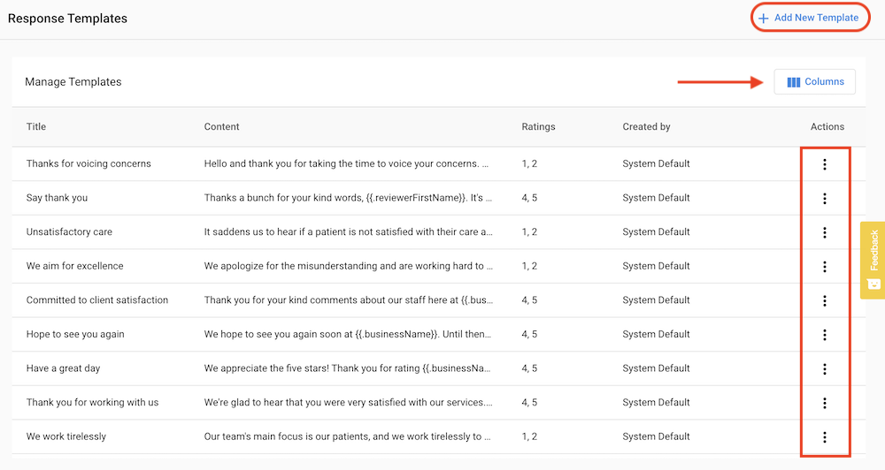

## What are Response Templates?

When responding to reviews in Reputation Management Pro, users get access to 80 unique templates designed to respond to different types of reviews, from 1 star to 5 stars. In addition, users can also create new response templates that offer even more unique and specific content (think product or service) that can be tailored to sentiment and star rating.

To access the Response Templates, just go to the main navigation in Reputation Management:

In the Response Template page, the user will see all the pre-written default responses to reviews. These can be accessed by clicking the kabob on the far right of the selection. See below. Also note the button for creating a new template in the top right corner and the "Columns" button just below it.

The "Columns" button can be selected to show which columns appear on the template page as seen to the left. To add a new template, click the "+ Add New Template" link in the top right corner. This will open a blank page that appears like this form below. From here a title, response and star rating can be created.

To edit one of the existing templates, simply click on the kabob on the right to show the "Edit / Delete" option for the template. Just click "Edit" to open the template and make changes.

After clicking "Edit" the Edit Response Template page will open offering the ability to change the title, the response, and the appropriate star rating. Note: Facebook only offers "recommended" or "not recommended" so select 5 stars or 1 star to satisfy those options.

When editing or creating new templates, the user has the option to include a dynamic field such as business name, reviewer name, phone number and other fields (see bottom image). To do this, click the "Insert dynamic field" link to open the window with all the available options.

List of available dynamic fields:

Once the template has been updated or created, just click the "save" button to be taken to main template page. Users can also decide to cancel the update or delete response.

For more information on responding to reviews please visit this page: [How to respond to reviews in Reputation Management](/reputation-management/how-to-respond-to-reviews-in-reputation-management). Also watch this [video webinar about the response templates](/reputation-management/video-webinar-about-response-templates).