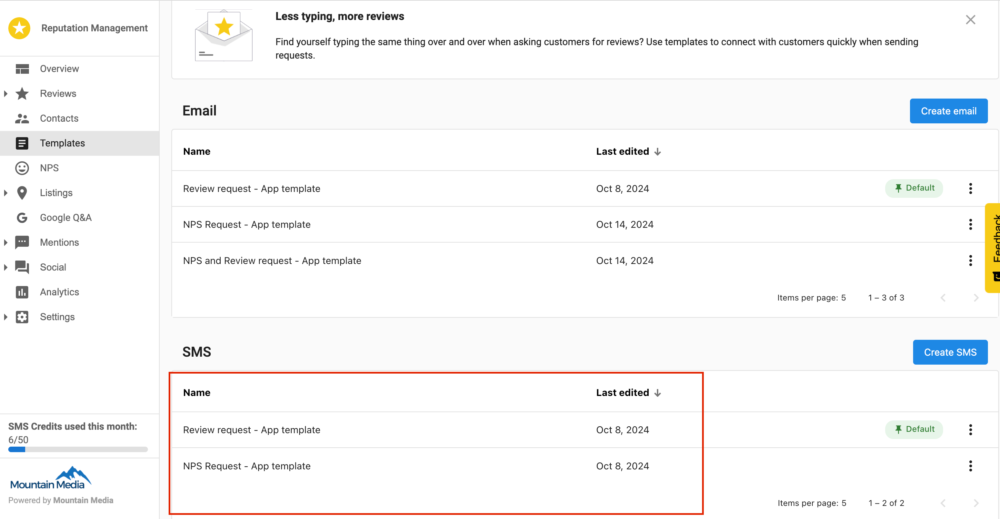

When your clients are looking to enhance their customer outreach with personalized review and NPS requests, having a flexible approach to SMS templates is key. With the SMS template management feature, they can easily create and organize custom templates tailored to their specific communication needs. This not only helps them engage customers more effectively but also increases response rates and strengthens their ability to manage online reputations through timely, personalized interactions.

## Where to find SMS templates

**Step 1 -** To create an SMS template: 

- Navigate to **Templates** in the side menu in Reputation Management Premium and select the **Request** tab.

- Under the **Requests** tab, you will find two sections: **Email and SMS.**

- In the SMS section, click **Create SMS.**

- A pop-up will appear asking you to select the type of request for the template.

1. **Reviews** - Use this option to send review requests. 
2. **NPS** - Use this option to send NPS (Net Promoter Score) surveys.
3. **Review and NPS** - Use this option for templates that will be used for both types of requests. 

- After selecting the request type, the SMS builder will open. 

- Once you have made any desired changes, click **Save.** You will now see the new template listed under SMS templates in the templates section. 

**Step 2 -** To manage SMS Templates: 

- Navigate to **Templates** in the side menu in Reputation Management Premium and select the **Request** tab. 
- Under the Request tab, you will find two sections: **Email and SMS.**
- In the SMS section, you can see all the created SMS templates will be listed. 

- Each template will have a three dot menu that offers the following options:  
  - Edit
  - Delete
  - Make Default 

- **Edit:** When a user clicks on the Edit option, they will be redirected to the SMS builder with the current template's configurations pre-loaded. The user can make any necessary changes and then save the updated template. 
- **Delete:** When a user selects the Delete option, a confirmation pop-up will appear with two choices: **Confirm Delete, or Cancel.**
  - **Confirm Delete:** If the user clicks Confirm Delete, the template will be permanently deleted from the system. 
  - **Cancel:** If the user clicks Cancel, the pop-up will close, and they will return to the template listing page without making any changes. 

- Make Default: If the user clicks Make Default, that particular template will be set as the default for SMS requests. This default template will be automatically used in automation processes and pre-loaded in the Request Review section when sending new review requests via SMS. 

## Types of SMS Requests 

Three types of SMS templates can now be created using the SMS builder:

**Review Request:** 

- Users can choose which review source (i.e. Google, Facebook) they want reviews from when sending a review request to contacts. 
- Multiple review source options allow users to select the specific site for the review request. 

**NPS Request:** 

- Users can configure NPS settings directly in the builder, with an NPS block appearing in the editor. 
- A checkbox is available to configure the redirection after the NPS survey is submitted. 

**Review and NPS Request:** 

- Users can include both Review and NPS blocks in a single template. 
- Both NPS and Review source configurations can be managed within this option, allowing for flexible requests.